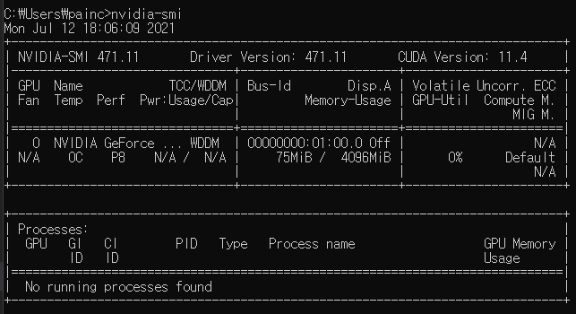

# 쿠다 아나콘다 셋팅

---

```
GPU = 1050TI(Notebook)


```

### 설치리스트

- 아나콘다
- [Tensorflow](Tensorflow)
- [nvidia 제어판](###nvidia제어판)
- visualStudio
- cuda

- cuDNN

### 아나콘다

- 가상환경 만들기
  - `conda create -n 만들고자하는환경이름 python=원하는버전 anaconda`

### Tensorflow

- 명령어
  - pip3 install tensorflow-gpu

### nvidia제어판

- [내 노느북 드라이버 설치 링크](https://www.nvidia.co.kr/content/DriverDownload-March2009/confirmation.php?url=/Windows/471.11/471.11-notebook-win10-64bit-international-dch-whql.exe&lang=kr&type=geforcem)
  - Nvidia Verion = 471.11
- [드라이버 설치](https://www.nvidia.co.kr/Download/index.aspx?lang=kr)
  - 위 링크를 들어가서 자신의 그래픽카드에 맞는 드라이버 설치
  - 설치 후 `CMD`를 키고, `nvidia-smi` 명령어를 이용하여 잘 설치 되었는지 확인해준다.
- 설치 확인
  - 

### Visual Studio

- Visual Studio를 깔지 않으면 안 깔리는 것들이있다.
- Community 버전을 설치하자...
- 설치할 항목
  - c++

### Cuda

- [내 노트북 설치](https://developer.nvidia.com/cuda-10.1-download-archive-base?target_os=Windows&target_arch=x86_64&target_version=10&target_type=exelocal)

  - CUDA Toolkit 10.1 original Archive

- [Cuda 설치](https://developer.nvidia.com/cuda-toolkit-archive)

  - 자신이 사용하고자 하는 텐서플로우에 맞춰 설치해준다.

- 환경설정 해주기

### cuDNN

- [cuDNN 설치](https://developer.nvidia.com/rdp/cudnn-download)
  - cuda 및 tensorflow와 맞는 버전을 설치

## numpy, scpic 버전

tensorflow-gpu 2.3.0 requires numpy<1.19.0,>=1.16.0, but you have numpy 1.19.0 which is incompatible.
tensorflow-gpu 2.3.0 requires scipy==1.4.1, but you have scipy 1.7.0 which is incompatible.
