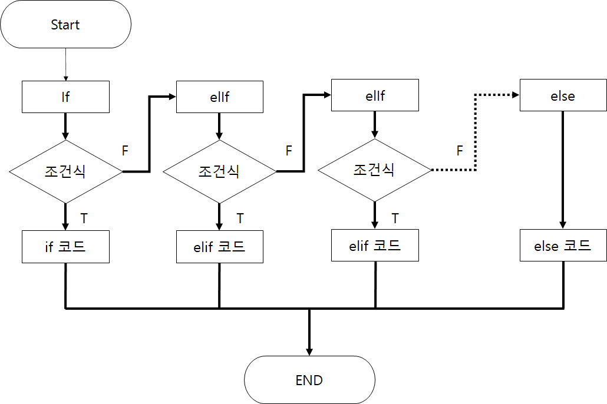

# **목차**

<details>
<summary>목차들</summary>  
<div markdown="1">

- [세미콜론&블록구분&주석](#세미콜론&블록구분&주석)
- [연산자](#연산자)
- [조건문](#조건문)
- [변수](#변수)
- [자료형](#자료형)
- [반복문](#반목문)
- [파일입출력](#파일입출력)
- [함수](#함수)
- [클래스](#클래스)
- [예외처리](#예외처리)

</div>
</details>
<br>

---

<br>
<br>

# **세미콜론&블록구분&주석**

<details>
<summary>내용</summary>
<div markdown="1">

## 세미콜론

- 파이썬에서는 굳이 ;를 사용할 필요가 없다!
  ```python
  print("이렇게 쓸 필요 없어요~");
  print("세미콜론은 쓰지말아요~")
  ```

## 블록구분

- `{}`로 묶어서 블록구분을 하는 것이 아니라 `들여쓰기`로 구분함

  - 예시
  - ```python
    # 단순구현
    def wordCnt(sentence):
        sentenceList = list(sentence.split())
        sentenceListLen = []
        for i in range sentenceList:
        sentenceListLen.append(len(i))
        return sentenceListLen

    # 맵을 이용
    def wordCnt2(sentence):
        return list(map(len,list(sentence.split())))
    ```

## 주석

- 파이썬은 `'#'`으로 주석처리를 한다.

```python
# 주석입니다.
```

</div>
</details>
<br>
<br>

# 연산자

<details>
<summary>내용</summary>
<div markdown="1">

- 사칙연산자
  |연산자|내용|사용방법|연산자|
  |------|---|---|-|
  |+ | 덧셈 연산자이다. |ans = A+ B ||
  |- | 뺄셈 연산자이다. |ans = A - B ||
  |/ | 나눗셈 연산자이다. |ans = A / B||
  |//| 나눗셈 연산자이다. |'/'와 다른점은 소숫점 아래는 버린다. ||
  |_ | 곱셈 연산자이다. |ans = A _ B| |
  |**| 거듭제곱 연산자이다.| ans = A ** B||
  |% | 나머지 연산자이다. | ans = A % B| |

- 논리연산사

  | 연산자 | 내용                                        | 사용방법      | c / java연산자 |
  | ------ | ------------------------------------------- | ------------- | -------------- |
  | and    | A 와 B 모두 True 여야 결과값이 True가됨     | A>B And A > C | &&             |
  | or     | A 혹은 B 하나라도 True 면 결과값이 True가됨 | A>B And A > C | \|\|           |
  | not    | 반댓 값으로 만들어줌                        | not A > B     | !              |

- 비교 연산자

  | 연산자 | 내용                      | 사용방법 |
  | ------ | ------------------------- | -------- |
  | <      | 오른쪽 변수가 더 크다     | a < b    |
  | >      | 왼쪽 변수가 더 크다       | a > b    |
  | <=     | 오른쪽 변수가 같거나 크다 | a <= b   |
  | >=     | 왼쪽 변수가 같거나 크다   | a >= b   |
  | ==     | 양 변수가 동일하다        | a == b   |
  | !=     | 양 변수가 다르다          | a != b   |

</div>
</details>
<br>
<br>

# **조건문**

<details>
<summary>내용</summary>
<div markdown="1">

- IF ... elif .... else
- 

- 사용방법
  - ```python
      if 조건식 :
            연산식
      elif 조건식 :
            연산식
      else 조건식 :
            연산식
    ```
- 코드
  - ```python
      a,b = 5,5
      if a>b :
            print("a가 더 크다)
      elif a<b :
            print("b가 더 크다)
      else 조건식 :
            print("a와b는 동일하다 )
    ```
- 위와 같이 elif는 여러개를 만들 수 있다.
</div>
</details>
<br>
<br>

# **변수**

<details>
<summary>내용</summary>
<div markdown="1">

- > 변수는 `"변하는 수"` 로서 컴퓨터 프로그래밍에서 아직 알려지지 않거나 어느 정도까지만 알려져 있는 양이나 정보에 대한 상징적인 이름이다.<br>
  > 위와 같이 말하면 어려우니. 간단히 말하면 데이터를 담을 그릇이라고 생각하면 좋을 것 같다.<br>
  > 예를 들어 커피잔에는 커피를 담으니 커피잔을 변수라고 생각하면 된다. C/C++과 같은 언어에서는 변수를 선언할 때 `"헝가리안 표기법"`에 의하여 변수, 함수 앞에 자료형을 지정해 주어야 한다.<br>
  > 하지만 파이썬은 신기하게도 그러지 않아도 `자동`으로 지정이 된다.

- 변수의 의미
  - 값을 참조할 수 있도록 저장하는 메모리 공간
- 변수명
  - 변수에 접근하고 할당 받은 값을 저장하거나 그곳에 있는 값을 읽기 위해
    지정한 이름
- 변수 선언
  - 오른쪽에 변수명을 정의하고 할당연산자를 사용해서 변수 값을 왼쪽에 대입한다.
    - Ex) [변수명] = [대입 값]
  - 저장할 공간을 할당하고 이름을 붙이는 것을 변수 선언이라고 함
  - 변수명 = 대입값
  - python은 대입값에 따라 자동으로 변수 타입 결정 ( 만약 빈 변수를 만들고 싶다면 none을 삽입한다)
- 변수 명명 규칙
  - 첫글자는 영문 소문자로 하며, 숫자나 특수기호 제외
  - 예약어는 변수명으로 사용불가
  - 변수명내 공백불가
  - 대소문자 구분주의
- c와 python 차이

  - | C/C++           | Python     |
    | --------------- | ---------- |
    | int number = 1; | number = 1 |

</div>
</details>
<br>
<br>

# **자료형**

<details>
<summary>내용</summary>
<div markdown="1">

- > 자료형이란 무엇인가? 간단하게 말하면 변수의 종류를 정해주는 것이라고 생각하시면 편합니다.<br>
  > 이전에 변수를 그릇이라고 표현을 했던 것을 다시 가져와 보겠습니다.<br>
  > "커피잔"은 "커피"를 담는 잔입니다. 그러면 이것의 자료형은 "커피"라고 생각하시면 편합니다.<br>
  > "맥주"를 마실땐 "맥주잔"에 따라 마시는 것처럼 그릇에 담을 것에 대한 규칙을 정해주는 것입니다.<br>
  > 즉 자료형이 int인 변수가 있다면 그 변수에는 int 값을 넣어주어야 합니다. (그렇지 않으면 에러가 발생할 수 있습니다 )

정리할 것들

- [숫자](###숫자)
  - 정수형 (Integer)
  - 실수형 (Float)
- [논리형](###논리형)

  - 논리형(Bool/Boolean )

- [문자열](###문자열)
  - 문자열(String)
- [시퀀스](###시퀀스)
  - 리스트(List)
  - 튜플(Tuple)
  - 셋(Set)
  - 사전(Dict)

### 숫자

<details>
<summary>내용</summary>
<div markdown="1">

- 숫자 자료형은 일반적으로 수를 계산할 때 많이 사용합니다.

- 정수형
  - ```python
        decimal  = 10 # 10진수
        binary = 0b1110 #2진수
        octal  = 0o77 #8진수
        hexadecimal = 0xFF#16진수
    ```
- 실수형

  - ```python
      f = 1.0# float
    ```

</div>
</details>
<br>
<br>

### 논리형

<details>
<summary>내용</summary>
<div markdown="1">

- 논리 연산자로, True,False로 이루어진 자료형
  - bool / boolean 타입이다.
- ```python
    a = True #bool
  ```

</div>
</details>
<br>
<br>

### 문자열

<details>
<summary>내용</summary>
<div markdown="1">

- 문자열의 구조는 리스트와 유사
  - 문자열 추출 대괄호 \[index_slicing\]를 사용
  - 문자열 결합은 '+' 기호를 사용
  - 문자열 바꾸기는 바꿀 문자열을 찾아낸 다음에 대체 함수(replace) 사용
    - 'xxxxyyxx'의 문자열에서 yy를 zz으로 바꾸기 위한 예시 'xxxxyyxx'.replace('y','z')
- 문자열 특징
  - 문자열 String 문자의 연속이고 리스트의 특징
  - 문자열 찾기 메소드 find('찾을 문자') 결과값은 문자의 위치정보, 없을경우 -1을 출력
  - 문자열 바꾸기 메소드 replace(' 바꿀 문자', '바뀔 문자')
  - 문자열을 특정 문자 기준으로 나누는 메소드 split('기준 문자열')
  - 리스트에 담긴 문자열을 합치는 방법 ' 기준 문자열'. join(문자열 리스트)
  - 대문자 소문자 메소드 upper(), lower()
- 문자 변환 메소드
  - 지정 문자 삭제하기 ( Default : '공백' )
    - strip(\[지정문자\]) : 모든 \[지정문자\] 삭제하기
    - rstrip(\[지정문자\]) : 문자열 오른쪽 \[지정문자\] 삭제하기
    - lstrip(\[지정문자\]) : 문자열 왼쪽 \[지정문자\] 삭제하기
  - 문자열 정렬하기
    - ljust(\[길이\]):문자열을 왼쪽으로 정렬 ( \[길이\] 만큼 길이(메모리)를 잡고 정렬해줌 )
    - rjust(\[길이\]):문자열을 오른쪽으로 정렬 ( \[길이\] 만큼 길이(메모리)를 잡고 정렬해줌 )
    - center(\[길이\]):문자열을 중앙으로 정렬 ( \[길이\] 만큼 길이(메모리)를 잡고 정렬해줌 )
  - 문자열 채우기
    - zfill(\[길이\]): "zero fill"을 의미하고, \[길이\]에 맞춰 문자열의 왼쪽에 0을 채움
  - 문자열 찾기
    - find(\[지정문자\]) : \[지정문자\]를 왼쪽부터 검색하고, 찾았으면 인덱스 값, 없으면 -1을 반환
    - rfind(\[지정문자\]) : \[지정문자\]를 오른쪽부터 검색하고, 찾았으면 인덱스 값, 없으면 -1을 반환
    - index(\[지정문자\]) : find와 동일하지만, 못 찾으면 Error을 발생함
    - rindex(\[지정문자\]) : rfind와 동일하지만, 못 찾으면 Error을 발생함
  - 문자열 갯수 세기
    - count(\[지정문자\]) : 문자열에서 \[지정문자\]를 찾고, \[지정문자\] 개수를 반환함.
- 메서드 체이닝 ( Method Chaining )
  - 문자열 메소드를 여러 개를 이어 붙여 연쇄적으로 적용하는 것.
    - ex) 'hi'.rjust(5).upper()
      - 위와 같이 진행하면 \[" HI"\]와 같은 모양으로 변환된다.
- 문자열 포멧팅(string Formating)
  - '%\[길이\]s'% \[문자열\]: 문자열 안에 있는 %s에 \[문자열\]을 삽입한다.
  - '%\[길이\].\[자릿수\]f'% \[실수\]: 문자열 안에 있는 %f에 \[값\]을 삽입한다.
    - 만약 소수점 2번째까지 출력하고 싶다면, '%.2f' % 2.333과 같이 삽입하면 된다.
  - '%\[길이\]d'% \[정수\]: 문자열 안에 있는 %f에 \[값\]을 삽입한다.
  - '{ 별칭 }'.format(\[별칭\]=\[지정문자\])
    - ' {} {} {} '.format( 값1 , 값2 ,값 3 )
    - ' {별칭1 } {별칭 2} {별칭 3} '.format( 별칭1 = '값1',별칭2 = '값2',별칭3 = '값4' )
  - format 정렬인덱스 Default : 0
    - '{\[인덱스\] : > \[길이\]}'.format( \[값\] ) : 인덱스부터 길이만큼 길이를 잡고, 왼쪽 정렬
    - '{\[인덱스\] : < \[길이\]}'.format( \[값\] ) : 인덱스부터 길이만큼 길이를 잡고, 오른쪽 정렬
  - format 자릿수인덱스 Default : 0
    - '{\[인덱스\] : 0\[길이\]d}'.format( \[값\] ) : 정수형 출력 시 길이만큼 잡고 삽입.
    - '{\[인덱스\] : 0\[길이\].\[자릿수\]f}'.format( \[값\] ) : 실수형 출력 시 길이만큼 잡고 삽입.

```python
  var_string = 'This is String'
```

</div>
</details>
<br>
<br>

### 시퀀스

<details>
<summary>내용</summary>
<div markdown="1">

### 리스트 (List)

- 리스트는 변수들의 묶음이다. 아래 설명하겠지만, 튜플과 유사하다.

  - 리스트는 대괄호로 표현
    - 생성 : []
    - 조회 : 리스트객체[인덱스슬라이싱]
  - 대괄호 내에 ,(콤마)를 사용하여 항목을 구분
  - 내부 요소 변경 가능 ( 튜플과 가장 큰 차이점 )

```python
# l 이라는 리스트 객체 생성, 객체에는 1,2,3원소 사용
l = [1,2,3]
# l 객체에서 첫번째 원소 조회
l[0]
# l 객체에서 처음부터 두번째 원소까지 조회
l[0:2]
# l 객체를 역순으로 조회
l[::-1]
```

### 튜플 (Tuple)

- 리스트는 대괄호로 표현
  - 생성 : ()
  - 조회 : 리스트객체(인덱스슬라이싱)
- 대괄호 내에 ,(콤마)를 사용하여 항목을 구분
- 내부 요소 변경 불가능 ( 리스트와 가장 큰 차이점 )

```python
# t라는 튜플 생성
t = (1,2,3)
# 튜플 조회
print(t[0])
# 튜플 범위 조회
print(t[0:2])

```

### 셋 (Set)

### 정의

- 순서 및 중복이 없는 Sequence Type 변수다.

### 생성

- {} or set = { val1 , val2 , val3 }
  - Set은 다른 Sequence Type과 다르게 Set안에 Set을 삽입할 수 없다.

### 조회

- 특정 요소(객체)만 출력할 수 없다.
- [ 값 ] in [ SET ] : 값 유무판단을 한다. ( 있다면 True , 없다면 False 를 반환 ) - [ 값 ] not in [ SET ] : 값 유무판단을 한다. ( 있다면 False , 없다면 True 를 반환 )

### 메소드

- frozenset( iterable object )
  - frozenset obj = frozenset( iterable object ) : 변경 불가능한 Set
  - 요소를 추가하거나 삭제하는 연산 Method를 사용할 수 없다.
  - 기본 set과 다르게 frozenset은 frozenset 안에 frozenset을 넣을 수 있다.
- 집합연산

  - 합집합 ( Union )
    - [Set1] | [Set2]
    - set.union( [Set] , [Set2] )
    - [Set1] 과 [Set2]의 합집합을 반환한다 (중복은 없다)
    - 연산 후 할당하기.
      - [Set1] |= [Set2]
      - [Set1].update( [Set2] )
      - [ Set1 ]에 연산된 값이 삽입된다.
  - 교집합 ( Intersection )

    - [Set1] & [Set2]
    - set.intersection( [Set] , [Set2] )
    - [Set1] 과 [Set2]의 교집합을 반환한다 (중복은 없다)
    - 연산 후 할당하기.
      - [Set1] &= [Set2]
      - [Set1].intersection_update( [Set2] )
      - [ Set1 ]에 연산된 값이 삽입된다.

  - 차집합 ( Difference )
    - [Set1] - [Set2]
    - set.difference( [Set] , [Set2] )
    - [Set1] 과 [Set2]의 차집합을 반환한다 (기준은 [ Set1 ] 중복은 없다)
    - 연산 후 할당하기.
      - [Set1] -= [Set2]
      - [Set1].difference_update( [Set2] )
      - [ Set1 ]에 연산된 값이 삽입된다.
  - 대칭차집합 ( Symmertric difference )
    - [Set1] ^ [Set2]
    - set.symmetric_difference( [Set] , [Set2] )
    - [Set1] 과 [Set2]의 차집합을 반환한다 (기준은 [ Set1 ] 중복은 없다)
    - 연산 후 할당하기.
      - [Set1] ^= [Set2]
      - [Set1].symmetric_difference_update( [Set2] )
      - [ Set1 ]에 연산된 값이 삽입된다.
  - 포함관계 확인하기.
    - [Set1] &lt;= [Set2]
    - [Set1].issubset( [Set2] )
    - [Set1] 이 [Set2]에 포함된다면 True 그렇지 않다면 False를 반환한다.
    - [Set1] &gt;= [Set2]
    - [Set1].issuperset( [Set2] )
    - [Set2] 이 [Set1]에 포함된다면 True 그렇지 않다면 False를 반환한다.
    - [Set1] &lt; [Set2]
    - [set1] 이 [Set2]에 포함되면서, [Set2]가 더 크다면 True 그렇지 않으면 Fasle를 반환한다.
    - [Set1] &gt; [Set2]
    - [set2] 이 [Set1]에 포함되면서, [Set1]가 더 크다면 True 그렇지 않으면 Fasle를 반환한다.
    - [Set1] == [Set2]
    - [set1] 과 [Set2]이 동일한 Set이면 True 그렇지 않다면 False를 반환한다.
    - Set은 순서가 없으니, 안에 있는 요소만 비교한다.
    - [Set1] != [Set2]
    - [set1] 과 [Set2]이 동일한 Set이면 False 그렇지 않다면 True를 반환한다.
    - Set은 순서가 없으니, 안에 있는 요소만 비교한다.
    - [Set1].isdisjoint( [Set2] )
    - [set1] 과 [Set2]에 겹치는 요소가 없다면 True를 반환하고, 그렇지 않으면 False를 반환한다.
    - Set은 순서가 없으니, 안에 있는 요소만 비교한다.
  - 삽입
    - [Set1].add( [Obj] )
    - [Set1]에 Obj를 삽입한다.
  - 삭제
    - [Set1].remove( [Obj] )
    - [Set1]에 있는 요소중 Obj를 찾아 삭제한다.
      - 만약 Obj가 없으면 Error가 발생함.
    - [Set1].discard( [Obj] )
    - [Set1]에 있는 요소중 Obj를 찾아 삭제한다.
      - 만약 Obj가 없더라도 Error가 발생하지 않음.
    - [Set1].pop()
    - [Set1]에 있는 임의의 요소를 반환 후 삭제함.
      - 만약 Set1이 비어있다면, Error가 발생함.
    - [Set1].clear()
    - [Set1]에 있는 모든 요소를 삭제한다.
  - 복제
    - [Set1] = [Set2]
    - 얕은 복사 ( Shallow Copy ) 가된다.
      - Set1이 변경되면, Set2에 있는 값도 변경이된다.
    - [Set2] = [Set1].copy()
    - 깊은 복사 ( Deep Copy ) 가된다.
      - Set1이 변경되더라도, Set2는 변경되지 않는다.
  - 표현식 사용
    - { [식]in [변수] in [ Set ] if [조건식]
    - 조건에 맞는 값들을 [식]에 삽입한다.
    - if [ 조건식 ]은 생략해도 된다 ( 조건을 넣고 싶은경우에 사용.

### 사전 (Dict)

- 딕셔너리는 중괄호로 표현 {}
- key:value 쌍 형식
- dictionary를 생성하는 방법
  - dict()
  - dict(k1='a',k2='b')
  - {'k1':'a','k2':'b'}
- 조회시 key값으로 조회
  - dict[key]
- 요소 추가 혹은 변경시
  - 삽입
    - dict.setdefault( [ key ] , [ value ] )
      - value를 생략하면 None 값이 들어간다
  - 수정 & 삽입
    - dict[key] = value : key 값이 있으면 value 변경, 없다면 추가
    - dict.update( [key] = [value] , [key] = [value] ...) : key 값이 있으면 value 변경, 없다면 추가
      - 나열하여 여러개 수정 및 삽입할 수 있다.
  - 삭제
    - pop( [ key ] , [기본값] ) : key값을 찾아 반환 후 삭제한다. 없다면 [기본값] 을 반환한다
    - del dict[ [ key ] ] dict의 [ key ]값을 찾아 삭제한다.
    - popitem() 3.6이상 기준으로 마지막 값을 Tuple로 반환 후 삭제한다.
    - dict.clear() dict의 모든 값 삭제하기.
  - 조회
    - dict.get( [ key ] , [ 기본값 ] : key의 value를 조회한다. 실패시 [기본값]을 반환한다
    - dict.items() : (key , value) 형식으로 모든 값을 조회한다.
    - dict.key() : key 값을 조회한다.
    - dict.value() : value 값을 조회한다.
  - 리스트 혹은 튜플로 딕셔너리 생성
    - dict.fromkeys(key,value) : value가 없다면 None값이 삽입되고, 있다면 key : value쌍으로 구현됨.
  - 표현식 사용하여 구현
    - [ dict ]= {key : value for key ,value in [ dictionary ]} [ dict ]에 [ dictionary (꼭 dictionay가 아니여도 됨. ) ]에 있는 값들을 key값과 value을 받아 삽입한다.
    - [ dict ]= {key : value for key ,value in [ dictionary ] if 조건식 } : 조건식에서 True 인 것만 삽입한다.
  - 딕셔너리 안에 딕셔너리
    - [ dict ]= {key1 : { key : value } , key2 : { key : value }} 다른 2차원 배열처럼 삽입하면 된다. (개인적인 생각은 Json형식과 유사하다)
  - 할당 및 복사
    - x = y.copy() : y를 복제해서 x에 넣는다
      - x = y와 같이 넣을 수 있지만, 그렇게 하면 주소값이 같기 때문에 같은 딕셔너리가 된다.
    - x = y.deepcopy() : 다중 딕셔러니는 deepcopy를 깊은 복사가 된다. deepcopy를 사용하지 않으면 x가 변형되면 y도 변형됨 )

</div>
</details>
<br>
<br>

</div>
</details>
<br>
<br>

# **반목문**

<details>
<summary>내용</summary>
<div markdown="1">

### For

- 문법
  - for 반복자 in 반복객체:
  - [indent] 반복자를 활용한 문장(반복자는 필수가 아님)
  - break
    - 반복문 수행 도중 break문을 만나게 되면 반복문을 종료
    - break를 위해 조건문을 사용
  - contiue
    - 반복문을 수행하는 도중에 continue문을 만나면 반복문의 처음으로 돌아 가게 됨
    - continue를 사용하기 위해 조건문을 사용

### while

- 문법
- while 조건식:
  - [indent]수행문장
- while문은 조건식이 False 이거나 break문을 만날때 까지 반복
- while문의 조건식은 탈출 조건을 주어야 무한 반복을 하지 않는다

</div>
</details>
<br>
<br>

# 파일입출력

<details>
<summary>내용</summary>
<div markdown="1">

- 기본용어
  - 파일 -> 객체 : 언패킹(Unpacking)
  - 객체 -> 파일 : 패킹(Packing)
- 파일 모드 구조
  - 파일열기
    - 읽기 'r'
    - 쓰기
      - 파일의 내용을 버림 :'w'
      - 파일 끝에 추가 : 'a'
      - 파일이 있다면 에러 : 'x'
    - 읽기/쓰기
      - 파일의 내용을 버림 'w+'
      - 파일 끝에 추가
        - 파일 처음부터 쓰기 'r+'
        - 파일 끝부터 쓰기 'a+'
      - 파일이 있으면 에러 :'x+'
    - 텍스트모드 : t
      - 위의 읽기/쓰기 모드를 적고 뒤에 붙임
      - 'wt','at'...
    - 바이너리모드 : b
      - 위의 읽기/쓰기 모드를 적고 뒤에 붙임
      - 'wb','ab'...
- File Obj = open(FileName , Mode)
  - 파일을 읽어드릴 때 사용한다.
  - FileName : 확장자까지 작성한다.
  - Mode
    - 'r' (Read) 읽기 : 이미 있는 파일을 읽어드릴 때 사용
    - 'w'(Write) 쓰기 : 파일을 생성할 때 사용
- FileObj.write('문자열')
  - FileObj에 문자열를 쓴다. ( 객체 (파일)에 문자열을 저장한다 )
- FileObj.read()
  - 불러드린 FileObj의 데이터 ( 문자열 ) 을 return해준다.
- FileObj.close()
  - 파일 입출력작업을 마치면 close()을 이용하여 파일객체를 닫아준다.
- with open(FileName , Mode) as FileObj :  
      코드
  - 블록으로 묶인 작업을 끝내면 자동으로 Close해주어 번거로움을 덜어준다.
- FileObj.writelines( List )
  - 리스트안에 저장된 값을 파일객체에 저장한다
  - 리스트의 끝에는 '\\n'을 붙여야 리스트 객체간 구별을 할 수 있다.
    - 만약 끝에 '\\n'이 없다면 한 줄로 저장된다.
- FileObj.readlines( List )

  - 파일을 1줄씩 읽어드린다.
  - for문 / while문을 이용하여 파일 전체를 읽어드리는 경우가 많다.
    - 권장은 while이다 그 이유는 문자열의 길이를 명확히 알기 힘들기 때문이다.
  - while문으로 입력을 받는다면, 읽어드릴 객체( 문자열 ) 을 'None'으로 초기화 시켜줘야한다.
    - 초기화를 안 시켜주면 시작부터 빈 객체기 때문에 코드를 실행하지 않고 끝난다.
  - while로 파일읽기

  ```python
  with open(fileName , 'r') as file :
    line = None
    while line != '':
      line = file.readline()
  ```

  - for로 파일읽기

  ```python
    with open(fileName, 'r') as file :
      for line in file :

  ```

</div>
</details>
<br>
<br>

# **함수**

<details>
<summary>내용</summary>
<div markdown="1">

## 함수 사용방법

- 함수명(입력인수) : 사용하고자 하는 함수를 함수명으로 호출 후 인수가 필요한 함수일 경우 인수값을 사용

## 수학함수와 python 함수의 비교

- 수학함수 표현
- f(x) = x + 1
- pyhon에서 함수 정의\[indent\]수행문장
- \[indent\]return 값
- def 함수명(입력인수):
- def : 함수를 지칭하는 키워드
- 함수명 : 함수를 호출하기 위해 사용하는 명시적 변수
- 입력인수 : 수학 함수식에서 f(x)표현시 함수에 사용되는 x값
- return 값 : 함수를 수행 후 반환되는 값

## 함수를 만드는 이유

- 함수는 임의의 값을 받아 문장을 수행한 후 결과값을 출력하므로 함수를 이용하면 임의의 값에 대하여 재활용하기 위해 만든다.

---

## 함수 모양

def FuncName(var1, var2.. ) :

```
 """ 독스트링(Documentation String,Docstrings)"""

 코드

 return
```

- def
- : Define의 약자로써 선언한다는 의미를 가지고 있다.
- funcName
- : 함수의 이름이다.
- var
  - 매개변수는 함수에서 선언한 개수와 호출시에 넣은 개수가 동일해야한다
- : 인자값으로써 갯수는 여러개가 들어와도 상관이 없다.
- 독스트링(Documentation String,Docstrings)
  - """......""" 이와 같이 """로 묶어서 사용한다.
  - 독스트링보다 위에 코드가 있으면 안된다. 즉, 함수의 첫째줄부터 작성되어야한다.
- : 함수의 설명을 작성하는 것이다. (출력과는 무관하다, 주석같은 느낌이다.)
- return
  - return 뒤에 값이 없다면 , 그냥 함수를 종료시킨다.
- : return값이 없다면, 적지 않아도 무관하다.

## 언패킹 이용하기

- 리스트 혹은 튜플 앞에 ''를 삽입하여 사용한다.
  - 인자값이 여러개면 언패킹을 이용한다면 편하게 사용 할 수 있다.
    - 간단하게 리스트 혹은 튜플이 인자값과 1 : 1 맵핑이 된다고 생각하면된다.
    - 그럼으로 리스트 혹은 튜플의 길이가 인자값의 갯수와 동일해야한다.
    - Func(\*리스트)
    - Func(\*튜플)
  - 가변인수
    - def FuncName(\*매개변수):
    - `코드`
    - 가변인수 즉 길이가 변하는 리스트 혹은 튜플따위를 인자값으로 받을 때 사용한다.
    - 가변인수와 고정인수를 동시에 사용한다면, 고정인수, 가변인수 순으로 사용해야한다.
      - def FuncName(고정인수 , \*가변인수):
  - 위치 인수
    - def FuncName(\*\*매개변수):
    - `코드`
    - Func(\*\*딕셔너리)
    - \*\_를 두번 하는 이유는 \*한번만 사용하면 key값을 반환하고, \*\_을 사용하면 value를 반환한다.
  - 초기값 설정
    - def FuncName(매개변수 = value) :
      - 위와같이 선언한다면, 매개변수의 Default 값이 value가 들어간다.
      - 초기값을 설정한 변수들의 순서는 뒤로가야한다.
        - def FuncName(var1 , var2 = value): <- 가능
        - def FuncName(var1 = value , var2): <- 불가능
- \*

## 재귀함수

- 정의
  - 함수가 자기자신을 다시 호출하는 것이다.
  - 생성시에 탈출조건을 잘 정해줘야한다.
    - 탈출조건을 잘못 설정하면 무한루프가 된다.(프로그램이 끝나지 않음)
- 모양
  - def recursiveFunc() :

```
    코드
recursiveFunc()
```

## 람다식

- 람다식 ( 익명 함수 ) 이란?
  - 함수를 간단히 식 형태로 되어있어 람다 표현식 ( lambda expression ) 이라고 부른다.
  - 즉 return문하나 만 있는 함수라고 생각하면 편하다.
  - 람다식 안에서 새로운 변수생성 은 불가하다.
    - 람다식 외부에 있는 변수는 사용할 수 있다.
  - 주로 함수의 인수로 넣을떄 사용한다.
  - 아래 함수와 람다식은 같은 기능을 처리한다.

```python
def plus(x):
    return x+1
lambda x : x + 1
```

`결과값 : <function **main**.(x)>`

### 사용방법

- lambda 매개변수 : 식
  - 람다식을 변수에 할당시키면 재사용이 가능하다
  - LambdaVar = Lambda(람다식)

```python
(lambda x : x +1)(1)
```

`결과값 : 2`

### Sequence Type 사용하기

- (lambda 매개변수 : 식)(인수들)
  - 변수에 할당하지 않고 바로 사용시에 사용한다.
  - 한줄 계산시에 많이 사용한다.
  - 만약 인수를 list와 같은 Sequence Types으로 받는다면, 각각에 값처리가 된다.

```python
print(list( map (plus,[1,2,3]))) # plus는 위에 함수로 선언함.
print(list( map ( lambda x : x + 1 ,[1,2,3] ) ))
```

`결과값 : \[2, 3, 4\], \[2, 3, 4\]`

### 람다에 조건문 삽입하기

- lambda 매개변수 : 식1 if 조건식 else 식2
  - 조건식이 True면 식1, False면 식2를 반환한다.
- IF를 사용하였다면 반드시 ELSE를 사용해야한다

```python
nums = [1,2,3,4,5,6,7,8,9,10]
list(map(lambda x : -1 if x % 2  else x , nums))
```

`결과값 : \[-1, 2, -1, 4, -1, 6, -1, 8, -1, 10\]`

#### 조건문 안에 조건문 넣기

- lambda 매개변수 : 식1 if 조건식1 else 식2 if 조건식2 else 식3
  - 조건식이 True면 식1, False면 식2를 반환한다.
- 물론 이렇게 사용 할 수 있지만, 억지로 람다식을 구현한 느낌이다. 가독성이 떨어짐으로 Def를 이용하여 함수를 생성하여 사용하는 것을 권장한다.

```python
nums = [1,2,3,4,5,6,7,8,9,10]
list(map(lambda x : '식1' if x % 3 == 0  else '식2' if x % 2== 0 else '식3' , nums))
```

`결과값 : \['식3', '식2', '식1', '식2', '식3', '식1', '식3', '식2', '식1', '식2'\]`

### Map을 이용하여 Lambda사용하기

- list(map(lambda x,y : x\*y , 인자1,인자2)

```python
a = [1,2]
b = [2,3]
list(map(lambda x,y : x*y , a,b))
```

`결과값 : \[2, 6\]`

### Filter을 이용하여 Lambda 사용하기

- filter(함수, 반복가능한객체)
  - 함수가 True일 떄 객채를 가져온다.

```python
a = [1,2,3,4,5,6,7,8,9,10]
list(filter(lambda x : x > 5 and x < 10 , a))
```

`결과값 : \[6, 7, 8, 9\]`

</div>
</details>
<br>
<br>

# **클래스**

<details>
<summary>내용</summary>
<div markdown="1">

### 기본개념

- 객체를 표현하기 위한 문법
- `클래스가 무엇이냐 하면 필자가 공부를 할 때는 항상 붕어빵 기계를 비유하면서 설명을 들었습니다.` 적절한 표현이라고 생각합니다.
  > 위 말은 즉 `**객체 ( 붕어빵 )** 을 동일하게 만들기 위해 **붕어빵 기계 ( 클래스 )**` 가 필요하다는 것을 보여주고 싶었던 것 같네요.  
  > 이것을 제 말로 바꿔보면 객체 ( 붕어빵 ) 을 편하게 제작 및 변경( 팥 붕어빵, 슈크림 붕어빵. 등)하기 위해 붕어빵 기계가 있어야 한다는 것을 표현한 것 같네요.
  - 생성한 객체에 어떤 변형된 값을 넣느냐에 따라 값이 변하고, 동일한 것도 편하게 만들 수 있단 뜻입니다.

### 클래스 및 메소드 만들기

- 클래스 또한 다른 메소드 만드는 방법과 동일하게 **:** 을 마지막에 붙여줍니다.
- 메소드의 인자 값의 첫 번째 값은 반드시 **self**가 들어와야 합니다.
- 객체 사용은. 을 통하여 사용합니다.
  - 평상시에 자주 쓰는 int(), len(), list() , 등 이것들도 클래스 메소드입니다.

### 객체 생성 / 사용

- 클래스는 여러 번 재사용 가능합니다.
  - 아래와 같은 방식으로 같은 클래스를 여러 인스턴스로 사용할 수 있수 있습니다.
  - `인스턴스1 = 클래스() 인스턴스2 = 클래스() 인스턴스1.메소드( 인자 값 ) 인스턴스2.메소드( 인자값 )`

### 속성 값 생성

- \*\*init(self)를 선언하고, 안에 속성 값을 넣어줍니다.
- self의 의미는 Java 등의 this와 유사( 개인적인 생각엔 동일한 개념 )
- JAVA의 생성자( 객체 생성 시 초기값을 삽입해주는 느낌 )처럼 사용 가능합니다.
- 속성 접근 시 **self.속성명** 혹은 **"클래스명. 속성명"을** 이용하여 사용합니다.
  - self 혹은 클래스명 중 하나로 접근하면 되는데, 클래스명으로 하면 조금 더 가동성이 높아진다.

```python
class 클래스 이름:
    self.속성1
    def __init__(self, 매개변수1,매개변수2):
        self.속성2 = 매개변수1
        self.속성3 = 매개변수2
```

- 비공개 속성 (private attribute )
  - 속성 앞에 **\_\_** (언더바 2개 )를 삽입해준다.
  - 클래스 외부에서 접근할 수 없다.
  - 비공개 속성을 제어하려면, 클래스 내부에서 제어해야 한다.
    - 클래스 내부의 메소드를 이용하여 호출해서 사용하면 된다

```python
class 클래스 이름:
    def __init__(self, 매개변수1,매개변수2):
        self.__속성1 = 매개변수1
        self.__속성2 = 매개변수2
```

### 매개변수 위치 인수 ( 리스트 등 )로 받기

- 언패킹을 이용하면 된다.
  - 1차원이면, **'\*'** 를사용하고, 2차원이면 **'\*\*'**를 사용한다

```python
class 클래스 이름:
    def __init__(self, *argv):
        self.속성1 = argv[0]
        self.속성2 = argv[2]
```

```python
class 클래스 이름:
    def __init__(self, **argD):
        self.속성1 = argvD[ key1 ]
        self.속성2 = argvD[ key2 ]
```

### 객체 포함 확인( 클래스의 인스턴스 여부 판단)

- 반환 값 : True ( 포함됨 ) , False (포함 안됨)

```python
isinstance ( 인스턴스 , 클래스 )
```

### 정적 메소드 생성

- 인스턴스를 사용하지 않고 바로 사용할 수 있는 메소드
  - len() , range()...처럼 한 번에 사용할 수 있는 메소드들
- 정적메소드 앞에 @staticmethod를 붙여준다
  - @를 붙여서 하는것을 데코레이터라고 부른다 ( 추후 공부하면 따로올리겠습니다.)
- 정적 메소드는 인자값이 self가 아님으로 인스턴스 속성에 접근할 수 없다.
  - 인스턴스 속성에 접근할 필요가 없을때 주로 사용한다.

```python
class 클래스이름:
    @staticmethod
    def 메소드 ( 매개변수1, 매개변수2 ):
        코드
```

### 클래스 메소드 사용

- 정적 메소드와 유사함
  - 인스턴스 없이 호출할 수 있다.
- 정적 메소드와 차이점
  - 클래스의 속성 & 메소드에 접근 할 수 있다.

```python
clas 클래스이름:
    @classmethod
    def 메소드(cls,매개변수1, 매개변수2):
        코드
```

---

## 클래스 상속

### 기본개념

- 생성된 클래스를 재생성하는 것.
  - **부모 클래스**의 메소드 등을 상속받아 기능을 더 붙인 **자식 클래스를** 생성합니다.
- 필자는 '상속'을 배울 때 주로 비유했던 것이 '새'를 이용하여 한 것이 많았습니다. 간단히 말하자면 부모 클래스에 '**새**'라는 것을 선언합니다. 그 후 자식 클래스에서 상속을 받고, 새로운 기능인 '**날 수 있다'라는** 기능을 추가합니다. 그러면 자식 클래스에는 '**새**'라는 것은 선언되어있지 않지만, 상속받았기 때문에 그 기능을 사용할 수 있습니다.
- 글로 적으니 어려운 느낌이지만, 부모 클래스에 적혀있는 모든 코드들 자식 클래스에 저희 눈에는 없지만, 적어졌다 라고 생각해도 될 것 같습니다. ( 실제로는 그런 느낌이지만 그건 아닙니다.)
- 용어
  - 기반 클래스 ( 상속을 해주는 클래스 ) : 부모 클래스 , 슈퍼클래스
  - 파생 클래스 ( 상속을 받는 클래스 ) : 자식 클래스 , 서브클래스

### 상속 구현

- 클래스 선언 시 인자 값으로 기반 클래스를 삽입하여 사용한다.
- 만약 파생 클래스에서 '\_\_init\_\_'을 선언했다면, super().\_\_init\_\_()을 한 번은 호출해주는 것을 권장한다.
  - 만약 파생 클래스에서 '\_\_init\_\_'을 선언하지 않았다면, 자동으로 기반 클래스의 '\_\_init\_\_'이 호출된다.

```python
    class 기반클래스 :
        def __init(self):
            코드

    clss 파생클래스 (기반클래스명):
        def __init(self):
              super().__init__()
            코드

    clss 파생클래스2 (기반클래스명):
        코드

```

- 만약 위와 같이 구현하지 않고, 명확하게 구현하고 싶다면, 아래와 같이 적어주면 된다.
  - super()에 인자 값으로 (부모 클래스, self)를 삽입시켜준다.
    - 위와 같이 한다면, 명확히 부모 클래스로 연결된다.

```python
    class 기반클래스 :
        def __init(self):
            코드

    clss 파생클래스 (기반클래스명):
        def __init(self):
              super(기반클래스, self).__init__()
            코드

    clss 파생클래스2 (기반클래스명):
        코드
```

### 메소드 오버라이딩(재정의)

- 기반 클래스( 부모 클래스 )에서 구현한 메소드를 파생 클래스( 자식 클래스 )에서 재정의 하는 것
  - 메소드 명은 동일한데, 안의 구현 내용을 변경하고 싶을 때 사용한다.
- 아래와 같이 동일한 메소드명 및 동일한 인자수를 넣어 구현하면 된다.
- 오버라이딩을 하더라도, super()을 이용한다면, 오버라이딩 이전의 코드를 실행시킬 수 있다.

```python
    class 기반클래스 :
        def method():
            코드
        def method2(var1, var2):
            코드

# Overriding
    clss 파생클래스 (기반클래스명):
        def method():
            재정의할 코드
        def method2(var1, var2):
            재정의할 코드

```

### 다중 상속

- 다중 상속이란 2개 이상의 기반 클래스에서 상속을 받는 것이다.
  - 서로 다른 클래스의 기능을 모두 사용하고 싶을 때 사용한다.

```python
    class 기반클래스 1:
        def __init(self):
            코드

    class 기반클래스 2:
        def __init(self):
            코드

    clss 파생클래스 ( 기반클래스1 , 기반클래스2 ):
        def __init(self):
            super().__init__()
            코드

```

### 다이아몬드 상속

- 하나의 기반 클래스 A가 B, C에 상속을 시켜주고, D가 B, C에게서 상속을 받는 모양이다.
  - 구조가 복잡하여 클래스의 탐색 순서를 확인하고 사용하는 것을 권장함
    - 필자가 생각하기에는 그냥 안 쓰는 걸 권장합니다. ( 이유 : 오버라이딩을 했다면, 어떤 메소드를 사용할지 명확하지 않음 )
    - 그래도 사용하고 싶다면, **클래스.mro()**를 사용하여 호출 순서를 확인하고 사용하는 것이 좋다.

---

## 추상 클래스

### 기본개념

- 클래스를 생성할 때 기본적으로 구현해야 하는 메소드들의 틀을 만들어 주는 클래스
- 추상 클래스를 상속받은 클래스가 추상 클래스에서 정의한 메소드들을 구현하지 않는다면 에러 발생

### 생성 방법

- 사용하려면 abc (abstract base class ) 모듈을 반드시 import 해야 한다.
  - from abc import \* 혹은 import abc
- 추상 클래스의 메소드는 @abstractmethod를 붙여주어 상속 클래스라는 것을 명시해준다.
  - 만약 import abc로 호출하였다면, @abc.abstractmethod 라고 적어야 한다.
- 클래스 괄호 안에 metaclass = ABCMeta를 삽입한다.
  - ABCMeta 또한 abc.ABCMeta라고 적어야 한다.
- 추상 클래스는 상속시켜 오버라이딩을 하기 때문에 다른 코드를 삽입할 필요가 없다.
  - 기본적으로 추상 클래스는 인스턴스를 생성할 수 없다.

```python
from abc import *

class 추상클래스명 ( metaclass = ABCMeta):
    @abstractmethod
    def 메소드명(self):
        pass
    @abstractmethod
    def 메소드명(var1,var2):
        pass

```

</div>
</details>
<br>
<br>

# **예외처리**

<details>
<summary>내용</summary>
<div markdown="1">

## 개념

- 코드를 실행 중에 발생하는 에러를 처리하기 위한 처리입니다.

## 예외처리 하기

`특정 코드에 대한 예외처리`

```python
try:
    코드
except 예외명:
    코드
```

- 위와 같이 특정 에러에만 특별한 처리를 하고 싶으면 except를 이용하면 된다.
  - except는 여러개를 작성해도 된다.
- try문에서 에러가 발생하면, 그 코드 줄(발생 위치) 실행하지 않는다.
  - 에러에 맞는 except로 이동하여 처리한다.

`간단 예시`

```python
try:
    num = 2 /0
    print(num)
except ZeroDivisionError:
    print('0으로 나눌 수 없습니다.')
```

- 위와 같이 작성한다면 try문의 print(num)은 출력하지 않고, except에 '0으로 나눌 수 없습니다.' 가 출력된다.

`에러 메시지 받아오기`

```python
try :
    코드
except 예외 as 변수:
    코드
```

- 위와 같이 작성한다면 예외에 관한 메시지들을 받아올 수 있다.

```python
try:
    num = 2 /0
    print(num)
except ZeroDivisionError as e :
    print('0으로 나눌 수 없습니다.',e)
```

- 위와 같이 작성한다면 try문의 print(num)은 출력하지 않고, except에 '0으로 나눌 수 없습니다. division by zero'가 출력된다.

`위와같이 사용할 수 있지만, 모든 에러를 볼 수 있는 <font color = red > Exeception </font>을 많이 사용한다.`

```python
except Execption as e :
    print("Error 발생",e)
```

\` 위와같이 사용한다면 모든 에러 메시지를 받아올 수 있다.

## else 및 finally

- else는 예외가 발생하지 않았을 때 실행할 코드이다.
  - except: 가 실행했다면, 실행되는 코드 블록이다.
- finally는 예외 발생 여부와 상관없이 실행하는 코드이다.
  - except: 의 실행 여부에 상관없이 무조건 실행되는 코드 블록이다.

```python
try:
    실행할 코드
except:
    예외 발생시 실행할 코드
else:
    예외 발생하지 않는다면 실행할 코드
finally:
    예외 발생여부 상관없이 실행할 코드
```

`간단한 예시`

```python
try:
    num = 2 /2
    print(num)
except:
    print("Error 발생",e)
else:
    print("Error 발생 안했어요")
finally:
    print("코드 끝났어요")
```

`위와 같은 코드를 실행하면 '1'을 출력하고 else문과 finally문을 실행하게 된다.`

## 예외 발생시키기

- 위와 같은 방법으로는 파이썬에서 지정한 예외에 대한 처리만 할 수 있습니다.
- 개발자가 생각하는 상황을 예외처리를 하여 발생시키는 방법입니다.

### 방법

```python
raise 예외('에러 메시지')
```

### 예시

```python
try:
    x = int(input('2의 배수를 입력하시오.'))
    if x %2 ==1:
        raise Exception('2의 배수가 아니에요')
    print(x)
except Exception as e:
    print('예외가 발생!!',e)
```

`위와 같이 개발자가 예외 상황을 만들 수 있습니다.`

### 다시 except에서 실행 후 try문으로 돌아가기.

`"raise 예외('에러 메시지')" 넣기!`

```python
try:
    x = int(input('2의 배수를 입력하시오.'))
    if x %2 ==1:
        raise Exception('2의 배수가 아니에요')
    print(x)
except Exception as e:
    print('예외가 발생!!',e)
    raise RuntimeError('예외가 발생했어요!!')
```

- 코드 실행 중 raise를 만나면 실행 줄이 try로 돌아간다.

`"assert 조건식, 에러 메시지 "를 이용하여 발생시킬 수 있다.`

- 조건식이 FALSE면 예외를 발생시킴

```python
   x = int(input('2의 배수를 입력하시오.'))
   assert x %2 ==1 , '2의 배수가 아니에요'
```

- 위와 같이 사용하면 됩니다.
- 디버깅 모드에서만 실행됨.
  - `python -o 파일.py` 이렇게 실행시켜야 한다.

</div>
</details>
<br>
<br>

# **이름**

<details>
<summary>내용</summary>
<div markdown="1">
내용넣기
</div>
</details>
<br>
<br>
