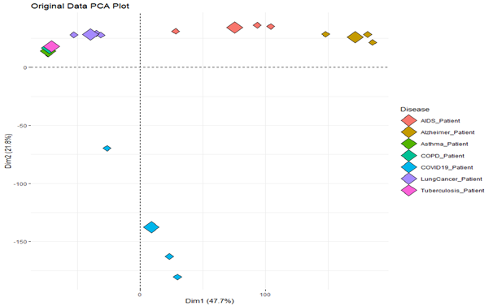
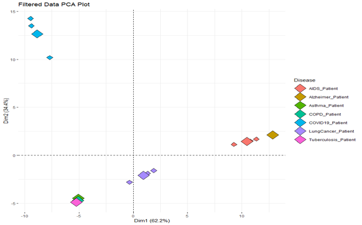
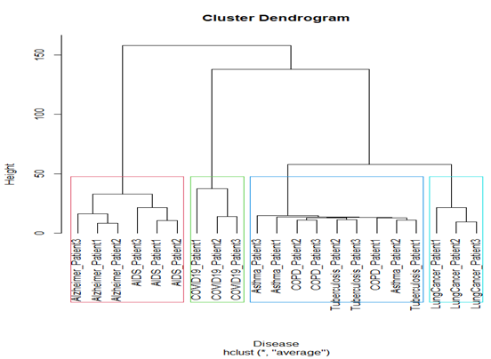
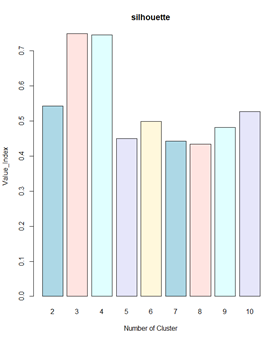
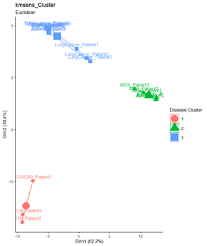

# 두번째 과제

## 과제 내용 및 답

1. [Q1] After performing PCA analysis on both data, try plotting using PC1 and PC2, respectively. When drawing a PCA plot, fill different colors depending on the disease. (Tip) There are 3 samples for each disease.

- 답
  - | Original                              | Filtered                              |
    | ------------------------------------- | ------------------------------------- |
    |  |  |

1. [Q2] Are there any significant differences in the results between the two data? What is the reason? If so, what data should be used?

- 답

  > PCA를 이용하여 PC를 생성하니 Filtered Data가 inter class 간 거리가 더 멀어졌고, intra class의 거리는 더 가까워졌습니다. 그럼으로 Filtered Data가 Original Data보다 환자의 질병에 관하여 잘 표현하고 있습니다.

- 이유
  > Original Data는 모든 데이터를 가지고 있습니다. 각 feature는 실제 데이터를 표현하는 정도의 차이를 가지고 있습니다. 이 feature 중 데이터를 잘 표현하지 못한 데이터와 잘 표현하는 데이터를 보유하고 있는데, 이중 잘 표현하지 못한 데이터를 Data Cleansing을 하여 양질의 feature들만 만든 데이터가 Filtered Data입니다. 그러므로 아래와 같이 다른 설명 정도를 보여줍니다.  Original을 보면, Dim1(PC1)은 47.7%로 데이터를 설명하고, Dim2(PC2)는 21.8%로 데이터를 설명합니다. 이 두 값을 합친다면, 69.5%로 데이터를 설명한다고 볼 수 있습니다.  Filtered는 Dim1(PC1)은 62.2%로 데이터를 설명하고, Dim2(PC2)는 34.4%로 데이터를 설명합니다. 이 두 값을 합친다면, 96.6%로 데이터를 표현합니다.  위 값을 통하여 Original(69.2%) 와 Filtered(96.6%)는 27.4% 더 잘 설명하는 것을 확인할 수 있습니다.  위와 같이 더 적은 양의 feature들을 사용하여 데이터를 더욱 명확하게 설명하기 때문에 즉 Computuing Time을 줄이고, 정확도가 높은 Filtered Data를 이용하는 것이 바람직합니다.
- 사용할 데이터
  > 그러므로 Filtered Data를 이용하여 분석해야 합니다.

1. [Q3] Perform clustering analysis using hierarchical clustering. Let's find the parameter in the format most similar to the PCA result (Distance Metric, Linkage Methods, and etc.) On the Dendrogram, cut and mark the optimal number of clusters you think.

- 그래프

  - 

- 답
  > 클러스터 검증 중 Q1의 Plot을 보시면, 질병들의 분포도를 볼 수 있습니다.   Asthma, COPD, Tuberculosis lungCancer을 같은 클러스터로 묶어서 3개의 클러스터로 볼 수 있지만, Asthma, COPD, Tuberculosis 이 3가지는 다른 데이터와 비교해서 intra class가 매우 낮아 lungCancer과 같은 Cluster로 놓는 것은 현명한 판단이 아니라고 생각되었습니다. 그럼으로 이 3개의 질병을 1개의 클러스터 보고 나머지와 분류하는 것이 합당한 Clustering이라고 생각하기 때문에 (Asthma, COPD, Tuberculosis ), (lungCancer), (AIDS, Alzheimer), (COVID19)이렇게 4개의 클러스터로 분류하는 것이 좋다는 판단을 내렸습니다. 또 "Silhouette"는 3, "Gap_stat"은 5 "WSS"는 4의 값이 생성되었습니다. 3개의 검증의 평균값이 4로 나왔기 때문에 제 판단에 확신을 얻었습니다.  Q1을 보면 Dim1은 62.2%, Dim2는 34.4%만큼 데이터를 표현합니다. 즉 상대적으로 Dim1의 위치가 더 중요하다는 것을 알 수 있습니다. 그러므로 Euclidean 과 Manhattan이 2가지 거리공식을 사용하고, 모든 linkage methods(complete,single,average)를 실행해 보니, 여러 가지 Dendrogram이 생성되었습니다. 그 후 각 Dendrogram을 Q1의 plot과 비교하면서 확인해보니, Asthma가 Dendrogram상에서 가장 높게 묶여있는 것이 Manhattan + Average Mathod 조합이기 때문에 이와 같은 Method를 이용하였습니다.
- 결과 : k = 4 , Distance Method = Manhattan, Linkage = Average Mathod

1. [Q4] Perform clustering analysis using kmeans clustering based on Euclidean Distance. Please find optimal number of clusters (k) by changing the from 2 to 10 based on the Silhouette Score. Draw a plot for silhouette score.

- 답
  - | Silhouette_Plot                               | K-means_Cluster_Plot                           |
    | --------------------------------------------- | ---------------------------------------------- |
    |  |  |

1. [Q5] Based on all of your analysis above, please feel free to interpret what the data is saying from the informatician standpoint. If possible, explain using the plot drawn in R as an evidence. Please complete this question within 2 pages.

   > i.e. Which unsupervised learning methods are good? How many clusters fit? The relationship between diseases. Disease prediction modeling possibility, ….. and etc.

- 답

  - 최적의 Cluster 개수
    > Q4를 이용하면, 3개가 최적입니다. 3개의 클러스터로 분류하는 것도 나쁘지 않은 판단이지만, 제 직관을 이용한다면 Q4의 Silhouette width의 결과보다는 Q3의 제 답을 기반으로 4개의 클러스터가 최적이라고 판단됩니다.  위에 설명했듯이, intra class 간 거리 때문입니다. Asthma, COPD, Tuberculosis의 intra 클래스의 거리가 다른 데이터에 비하여 극단적으로 짧기 때문에 다른 질병 표본과 같은 클러스터에 포함되는 것이 옳지 않다고 판단되었습니다. 그러므로 이 3개의 표본을 한 개의 클러스터로 묶고, 나머지 데이터들을 inter class 거리를 이용하여 Cluster로 묶는 것이 올바르다고 생각합니다.  (분류를 기준을 확인하기 어려울 것 같아 검정 - 빨강 순을 반복으로 넣었습니다.)  만약 더 섬세하게 분류한다면 (COVID19, (Asthma, COPD, Tuberculosis), Lung Cancer, AIDS, Alzheimer)로 5개의 클러스터로 분류할 수 있지만, 이렇게 된다면, AIDS와 Alzheimer의 inter class 거리가 너무 밀접하므로 유의미한 분류가 아니며, 그 이상 또한 같은 이유로 의미가 없을 것 같고, 2개로 하면 Asthma, COPD, Tuberculosis, Lung Cancer 이것들과 COVID19의 inter class 거리가 너무 멀기 때문에 좋지 않을 것이라 판단되었습니다.

- 질병 간 관계
  > 현재 보유한 데이터에는 7개의 질병을 갖고 있습니다.  Q3의 Dengrogram을 본다면, Asthma, COPD, Tuberculosis 이 3가지는 분류하기 어렵다는 것을 확인할 수 있습니다. 왜냐하면, 각 질병 간 어떤 linkage method, distance method를 이용하더라도 순서대로 즉 같은 질병끼리 묶여서 다른 질병과 묶이는 경우는 없었습니다. 그러므로 이 3개의 질병은 구분하기 어렵다는 것을 알 수 있습니다.  이 3개의 질병을 기반으로 그 다음 유사한 질병은 Lung Cancer이라는 것을 확인할 수 있습니다. 그 근거로는 K - mean Cluster를 k=3으로 구한 결과, 위 3개의 데이터와 같이 묶이고, Dendrogram에서도 가장 가까운 데이터라는 것을 보여주기 때문입니다.  그 다음 유사한 데이터는 K - mean Cluster를 보면, AIDS, Alzheimer와 거리상으로는 가까워 보이지만, 그래프를 잘 보시면 Dim1은 62.2%, Dim2는 34.4% 만큼 표본을 설명합니다. 그러므로 위 두 질병보다는 Dim2는 멀지만, Dim1이 가까운 COVID19이 더 유사하고, 또 Q3의 Dendrogram을 보시면 그다음으로 묶이기 때문에 Lung Cancer 다음으로 유사한 질병이라고 볼 수 있습니다.  그러므로 위 순서대로 묶이고 마지막으로 AIDS, Alzheimer 가 묶입니다. 이것을 표현하면 ( ( ( (Asthma, COPD, Tuberculosis),LungCancer),COVID19), AIDS, Alzheimer) 이렇게 묶이는 것을 볼 수 있습니다.  (각 dim이 설명하는 정도의 차이가 약 2배 나기 때문에 2배로 계산)  하지만 Q4의 3번째(Asthma, COPD, Tuberculosis) 클러스터와 2번째 클러스터(AIDS, Alzheimer)가Dim1은 15 \* 2, Dim2는 약 6의 차이가 있으므로 클러스터 거리가 약 30 정도 차이가 나기 때문에 멀리 있다는 것을 볼 수 있습니다. 그러므로 이 두 질병의 연관성은 상대적으로 적다는 것을 추측할 수 있습니다.  또 이것을 기반으로 Lung Cancer과 COVID19 차이 또한 약 Dim1은 10 \* 2, Dim2는 15로약 25의 거리를 가지고 있으므로 이 두 질병 또한 유사성이 떨어진다고 볼 수 있습니다.  즉 COVID19 과 Lung Cancer는 (Asthma, COPD, Tuberculosis)과 와 유사한 특성이 있지만, COVID19 과 Lung Cancer간 특성은 다를 수 있다고 판단이 됩니다.
