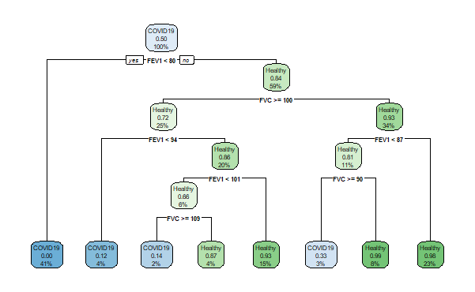

# 세번째 과제

## 과제 내용 및 답

1. [Step 1] Let's perform Decision Tree Modeling to predict COVID-19 patients based on the training set. Please visualize the decision tree on the training set using R-programming.

   - 답
     - 
       > Confusion Matrix  
       > Reference
       > | Prediction | COVID19 | Healthy |
       > | ---------- | ------- | ------- |
       > | COVID19 | 1692 | 70 |
       > | Healthy | 65 | 1742 |
       > [Accuracy] 0.9622
       > [Error Rate] 0.037
       > [Sensitivity] 0.9630
       > [Specificity] 0.9614

1. [Step 2] Interpret the model for what clinical variables can be used to predict COVID-19 patients based on the decision tree plot of [Step 1].

   - 답

     > Step 1의 그래프를 보면 FEV 와 FEV1을 이용하여 Desition Making을 합니다.  위 그래프에서 4가지 조건에 맞춰 COVID19 환자를 분류합니다.  
     >
     > 1. FEV1 < 80
     > 2. FEV1 < 94 , FVC >= 100
     > 3. FEV1 < 101 , FVC >= 109
     > 4. FEV1 < 87 , FVC >= 90
     >
     > 1번쨰 조건은 FEV1 < 80 COVID19 환자로 분류합니다.  2번째 조건은 ‘FVC’의 값이 100 이상이면서, FEV1값이 94미만이면 COVID19 환자로 분류합니다.  3번째 조건은 ‘FVC’의 값이 109 이상이면서 ‘FEV1’값이 101미만이면 COVID19 환자라 분류합니다.  4번째 조건은 ‘FVC’의 값이 90 이상이면서, ‘FEV1’값이 87 미만이면 COVID19 환자라 분류합니다.  위 4가지 조건 중 1개라도 속하지 않은 사람은 건강한 사람으로 분류합니다.

1. [Step 3] Apply it to test data based on the Decision Tree model [Step 1] and predict about 100 people who have not yet confirmed the diagnosis. Please paste the predictive result into the "Predictive value from Decision Tree" column in AnswerSheet.xlsx.

   - 답
     - EXCEL에 작성함

1. [Step 4] Do self-evaluation such as training-training error through KNN modeling with (k=7).

   - 답
     > [Contingency Table]
     > |Prediction| COVID19| Healthy|
     > |-|-|-|
     > |COVID19| 1136| 134|
     > |Healthy| 251| 1156|
     > [Accuracy] 0.8562
     > [Error Rate] 0.1438
     > [Sensitivity] 0.8241
     > [Specificity] 0.8806

1. [Step 5] Do self-evaluation such as training-training error through KNN modeling with (k=5).

   - 답
     > [Contingency Table]
     > |Prediction| COVID19| Healthy|
     > |-|-|-|
     > |COVID19| 1143| 154|
     > |Healthy| 244| 1136|
     > [Accuracy] 0.8513
     > [Error Rate] 0.1487
     > [Sensitivity] 0.8241
     > [Specificity] 0.8806

1. [Step 6] Do self-evaluation such as training-training error through KNN modeling with (k=3).

   - 답
     > [Contingency Table]
     > |Prediction| COVID19| Healthy|
     > |-|-|-|
     > |COVID19| 1148| 211|
     > |Healthy| 239| 1079|
     > [Accuracy] 0.8319
     > [Error Rate] 0.1681
     > [Sensitivity] 0.8277
     > [Specificity] 0.8364

1. [Step 7] Make predictions for 100 test samples based on three models 7-NN, 5-NN, and 3-NN. Please paste the predictive results of three models respectively into the each column in AnswerSheet.xlsx.

   - 답
     - Excel에 작성함

1. [Step 8] Based on all of your analysis above, please feel free to interpret what the data is saying from the informatician standpoint. If possible, explain using the plot drawn in R as an evidence. Please complete this question within 1 page.
   > i.e. Which supervised learning methods are good? What clinical variables important to predict COVID-19. Disease prediction modeling possibility, ….. and etc.

- 답

  1. Which supervised learning methods are good
     > 현제 교수님께서 주신 데이터로는 train Set 안의 데이터를 trainData를 6, testData를 4로 분할 후 Desition Tree를 이용하여 추측한 것이 Accuracy가 가장 높은 값으로 나와 현 상황에서는 가장 좋다고 볼 수 있습니다.  knn또한 train Set의 비율을 바꿔가며 분류를 해보았는데, trainData를 7, testData를 3이 가장 높게 나왔고, 그중 가장 높은 Accuracy 가 나온 것은 k = 7으로 진행 한 것이 0.8562로 가장 높았습니다. 하지만 이것은 Desition Tree를 이용하여 얻은 Accuracy 0.9622 보다 0.106가량이나 낮은 값을 가지고 있기 때문에 현 상황에서는 Desition Tree가 가장 좋습니다.
  1. What clinical variables important to predict COVID-19.

     > FEV1 및 FVC 이 가장 중요한 것으로 생각됩니다. 그 이유는 실제 데이터를 Excel로 확인할때 상대적으로 결과값을 추측하는데 유의미한 변화를 보여주는 값들이였고, 제가 단순히 생각 한 것이 아닌 Desition Tree를 구현하는 라이브러리인 rpart를 이용하여 구현시 비율, 순서 등을 여러 번 변경하여 진행하여도 FEV1과 FVC를 이용하여 분류하는 것만 보여주었습니다. 그럼으로 현 데이터안에서는 FEV1 과 FVC가 가장 유의미한 데이터라고 볼 수 있습니다.

  1. 결과
     > Feature가 많다고 실제로 supervised learning 시 좋다고 볼 수 없습니다. 잘 정제된 feature를 이용한다면 더 좋은 결과를 얻을 수 있습니다.  그 이유는 데이터를 보면, FEV1과 FVC가 가장 예측하는데 도움이 되는 값들입니다.  그 반면에 다른 Feature들은 상대적으로 예측하는데 도움이 되지는 않는 Feture라고 판단 하였습니다. 그리하여 다른 데이터를 배제하고, FEV1가 FVC만을 가지고 KNN을 실행을 해 보니. 그 결과 K 값이 3,5,7일 때 Accuracy가 0.85미만에서 0.96이상으로 향상된 값을 얻을 수 있었습니다. 그럼으로 feature수는 많으면 좋지만, 잘 정제되는 과정이 더 중요하고, COVID19는 나이, 인종 등 외적인 것, 혈압과 같은 혈관에 관련된 것, 과는 관련이 없다고 볼 수 있고, 폐에 이상이 있는 경우 즉, 폐질환이라고 볼 수 있습니다.  위 이유를 통하여 FEV1,FVC 의 2 Feature 을 이용하여 각 예측 값을 얻고, 이때 사용한 것은 Desition Tree와 KNN 3가지(k = 3, 5, 7) 입니다. 4개중 3개 이상이 Healthy라면 Healthy, 그것이 아니라면 COVID19라고 추측하였습니다.
