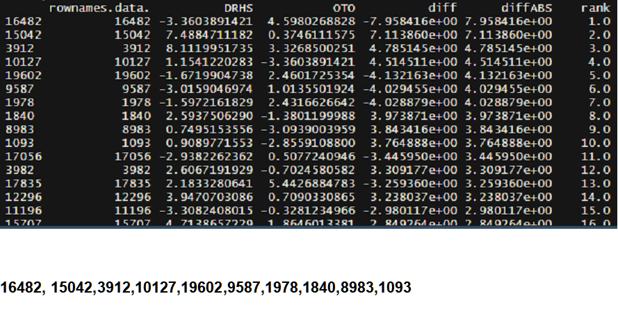

# 첫 번쨰 과제

## 과제 내용 및 답

1. [Question 1] What is top 10 features?
   > 
1. [Question 2] Please provide the implemented R code and running screen.

   ```R

   setRepositories()

   setwd   ("E:\\GoogleDrive\\SeungHyuen\\Korea_uni\\Class\\4-1\\Da   taMining\\Assignment\\Homework_1")

   data <- read.table("Homework1_SampleData.txt" , head =  T, sep = "\t")

   dim(data)


   label <- colnames(data)
   label <- factor(label)

   label[which(substring(label,1,4) == "DrHs")] <- "DRHS"
   label[which(substring(label,1,3) == "Oto")] <- "OTO"

   DRHS <- OTO <- c()

   for( i in 1 : nrow(data)){
     DRHS[i]  = mean(as.numeric(data[i,])[which(label ==   "DRHS")])
     OTO[i]  = mean(as.numeric(data[i,])[which(label ==    "OTO")])
   }

   ## Difference between ALL and AML based on the central  Location
   diff <- DRHS - OTO
   diffABS <- abs(diff)
   hist(diffABS)

   ##Generating Ranking
   rank <- rank(-diffABS)
   names(data)
   colnames(data)
   label

   ##Generating output table
   output <- data.frame(colnames(data),DRHS,OTO,diff,  diffABS, rank)
   output_order <- output[order(rank),]
   write.table(output_order, "Result_Assignment01.txt",    sep = "\t", quote = F, row.names = F)


   ```

1. [Question 3] Apparently, it is possible to select a feature that is important enough only by the difference in the sample mean. What is wrong with this method? Freely describe with your knowledge and everything you have learned. (Within half a page)
   > Mean 혹은 median 값을 이용하여 값을 지정하는 것은 간편하게 feature selection을 하는 방법입니다. 이것은 다른 변수를 생각하고 고르는 것이 아니기 때문에 문제가 일어날 수 있습니다. 그중 Outlier가 발생한다면 이것 때문에 좋은 feature을 선택하지 못 하게 될 수 있습니다. <br/><br/>또 여기서 mean 값을 사용한 이유는 median값은 좋기는 하지만 수식화 시킬 수 없기 때문입니다. 그 말은 즉, 고차원의 연산을 하기 어렵다는 말과 동일합니다. 그럼으로 통계학 및 컴퓨터공학과 둘 다 특이 사항이 아니면 median값을 사용하는 것이 아니라 mean 값을 사용합니다
