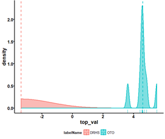
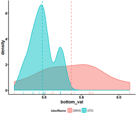

# 두 번째 과제

## 과제 내용 및 답

1. [Question 1] What is null and alternative Hypotheses?
   > Null Hypotheses : DrHs와 Oto의 차이가 없습니다.  Alternative Hypotheses : DrHs와 Oto의 차이가 있습니다.  현재의 feature수는 19892개입니다.   P -value가 0.01보다 작은경우가 750개 가량밖에 없고, 널널 하게 p – value가 0.05보다 낮은 경우의 feature수는 2061개 뿐이기 때문에 차이가 없다고 볼 수 있습니다. 또한 Feature 전체의 P – VALUE가 0.1305이므로 특수한 상황에만 차이가 있고, 나머지 상황 즉 대다수의 Feature들은 연관관계가 없다고 볼 수 있습니다.
1. [Question 2] What are the 10 features with the lowest P-values and what is the P-value at that time?
   > | Features (Order by Rank) | P-value      |
   > | ------------------------ | ------------ |
   > | Feature16482             | 9.396348e-19 |
   > | Feature15042             | 3.608986e-15 |
   > | Feature10127             | 4.393238e-15 |
   > | Feature9587              | 2.911860e-13 |
   > | Feature1978              | 2.720003e-11 |
   > | Feature8983              | 3.794195e-11 |
   > | Feature3317              | 3.035897e-10 |
   > | Feature9977              | 2.686599e-09 |
   > | Feature17461             | 7.925846e-09 |
   > | Feature18936             | 1.015702e-08 |
1. [Question 3] Are the results of the top 10 features of [Method 1] and [Method 2] the same? If different, why is it different?

   > 몇몇개는 같지만 대다수가 다릅니다.  다른 이유는 Method 1 은 단순히 mean값의 절댓값만으로 산출하여 분산정보를 고려하지 않았습니다. 반면에 “Method 2”는 산포정보까지 고려하여 산출간 결과이기 때문에 결과가 다릅니다.

1. [Question 4] Draw and compare the density plots of the top 1 feature (=lowest P-value) and bottom 1 feature (=largest P-value) based on the Method 2 results. What is the difference?

   > | Top_val                       | bottom_val                          |
   > | ----------------------------- | ----------------------------------- |
   > |  |  |
   >
   > Density plots을 그려보면 위와 같이 나옵니다. 위 그래프를 보면, 현재 산포정보를 볼 수 있습니다.  즉, t-test를 이용하여 p-value를 추출하여 비교를 한다면, p – value의 값이 크다면, feature들의 표준편차가 작고, p-value의 값이 작다면 표준편차가 크다는 것을 볼 수 있습니다.  즉, p value가 낮다면 각 집합이 잘 분산되어 있고, p-value 높다면 각 집합이 잘 분산되지 못하고 있다는 것을 볼 수 있습니다.  추가적으로, p-value의 값에 따라 mean의 절댓값 차이 또한 변동한다는 것을 볼 수 있습니다.

1. [Question 5] Features with a P-value <= 0.01 are considered as the important markers. How many features are less than 0.01? How does selecting a marker in this way differ from Method1's ranking method?
   > Method 2 에서는 750개의 feature들이 0.01보다 작았습니다.    Method1은 DRHS의 값과 OTO의 값의 차를 구한 후 이것을 절댓값을 씌워 그 값이 먼 것을 기준으로 순위를 정하였습니다. 반면 Method2 에서는 t-test Method를 이용하여 p-value를 구한 후 이 값의 작은 순서를 기준으로 순위를 정하였습니다.  그리하여 채택된 Rank의 순위가 다릅니다.
