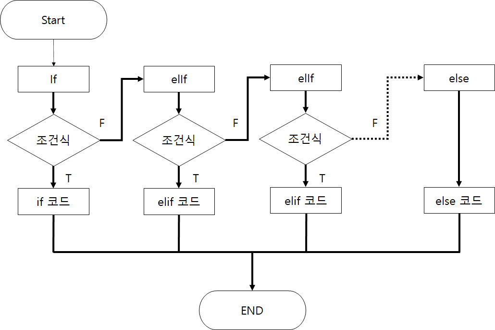

# **목차**

<details>
<summary>목차들</summary>  
<div markdown="1">

- [세미콜론](#세미콜론)
- [블록구분](#블록구분)
- [주석](#주석)
- [조건문](#조건문)
- [변수](#변수)
- [자료형](#자료형)
</div>
</details>
<br>

---

<br>
<br>

# **세미콜론**

<details>
<summary>내용</summary>
<div markdown="1">

- ## 파이썬에서는 굳이 ;를 사용할 필요가 없다!
  ```python
  print("이렇게 쓸 필요 없어요~");
  print("세미콜론은 쓰지말아요~")
  ```

</div>
</details>
<br>
<br>

# **블록구분**

<details>
<summary>내용</summary>
<div markdown="1">

- `{}`로 묶어서 블록구분을 하는 것이 아니라 `들여쓰기`로 구분함

  - 예시
  - ```python
    # 단순구현
    def wordCnt(sentence):
        sentenceList = list(sentence.split())
        sentenceListLen = []
        for i in range sentenceList:
        sentenceListLen.append(len(i))
        return sentenceListLen

    # 맵을 이용
    def wordCnt2(sentence):
        return list(map(len,list(sentence.split())))
    ```

</div>
</details>
<br>
<br>

# **주석**

<details>
<summary>내용</summary>
<div markdown="1">

- 사칙연산자
  |연산자|내용|사용방법|
  |------|---|---|
  |+ | 덧셈 연산자이다. |ans = A+ B |
  |- | 뺄셈 연산자이다. |ans = A - B |
  |/ | 나눗셈 연산자이다. |ans = A / B|
  |//| 나눗셈 연산자이다. |'/'와 다른점은 소숫점 아래는 버린다. ans = A // B|
  |_ | 곱셈 연산자이다. |ans = A _ B|
  |**| 거듭제곱 연산자이다.| ans = A ** B|
  |% | 나머지 연산자이다. | ans = A % B|

- 논리연산사

  | 연산자 | 내용                                        | 사용방법      | c / java연산자 |
  | ------ | ------------------------------------------- | ------------- | -------------- |
  | and    | A 와 B 모두 True 여야 결과값이 True가됨     | A>B And A > C | &&             |
  | or     | A 혹은 B 하나라도 True 면 결과값이 True가됨 | A>B And A > C | \|\|           |
  | not    | 반댓 값으로 만들어줌                        | not A > B     | !              |

</div>
</details>

# **조건문**

<details>
<summary>내용</summary>
<div markdown="1">

- IF ... elif .... else
- 

- 사용방법
  - ```python
      if 조건식 :
            연산식
      elif 조건식 :
            연산식
      else 조건식 :
            연산식
    ```
- 코드
  - ```python
      a,b = 5,5
      if a>b :
            print("a가 더 크다)
      elif a<b :
            print("b가 더 크다)
      else 조건식 :
            print("a와b는 동일하다 )
    ```
- 위와 같이 elif는 여러개를 만들 수 있다.
</div>
</details>
<br>
<br>

# **변수**

<details>
<summary>내용</summary>
<div markdown="1">

- > 변수는 `"변하는 수"` 로서 컴퓨터 프로그래밍에서 아직 알려지지 않거나 어느 정도까지만 알려져 있는 양이나 정보에 대한 상징적인 이름이다.<br>
  > 위와 같이 말하면 어려우니. 간단히 말하면 데이터를 담을 그릇이라고 생각하면 좋을 것 같다.<br>
  > 예를 들어 커피잔에는 커피를 담으니 커피잔을 변수라고 생각하면 된다. C/C++과 같은 언어에서는 변수를 선언할 때 `"헝가리안 표기법"`에 의하여 변수, 함수 앞에 자료형을 지정해 주어야 한다.<br>
  > 하지만 파이썬은 신기하게도 그러지 않아도 `자동`으로 지정이 된다.

- 변수의 의미 -값을 참조할 수 있도록 저장하는 메모리 공간
- 변수명
  - 변수에 접근하고 할당 받은 값을 저장하거나 그곳에 있는 값을 읽기 위해 지정한 이름
- 변수 선언
  - 오른쪽에 변수명을 정의하고 할당연산자를 사용해서 변수 값을 왼쪽에 대입한다.
    - Ex) [변수명] = [대입 값]
  - 저장할 공간을 할당하고 이름을 붙이는 것을 변수 선언이라고 함
  - 변수명 = 대입값
  - python은 대입값에 따라 자동으로 변수 타입 결정 ( 만약 빈 변수를 만들고 싶다면 - none을 삽입한다)
- 변수 명명 규칙
  - 첫글자는 영문 소문자로 하며, 숫자나 특수기호 제외
  - 예약어는 변수명으로 사용불가
  - 변수명내 공백불가
  - 대소문자 구분주의
- c와 python 차이

  - | C/C++           | Python     |
    | --------------- | ---------- |
    | int number = 1; | number = 1 |

</div>
</details>
<br>
<br>

# **자료형**

<details>
<summary>내용</summary>
<div markdown="1">

- > 자료형이란 무엇인가? 간단하게 말하면 변수의 종류를 정해주는 것이라고 생각하시면 편합니다.<br>
  > 이전에 변수를 그릇이라고 표현을 했던 것을 다시 가져와 보겠습니다.<br>
  > "커피잔"은 "커피"를 담는 잔입니다. 그러면 이것의 자료형은 "커피"라고 생각하시면 편합니다.<br>
  > "맥주"를 마실땐 "맥주잔"에 따라 마시는 것처럼 그릇에 담을 것에 대한 규칙을 정해주는 것입니다.<br>
  > 즉 자료형이 int인 변수가 있다면 그 변수에는 int 값을 넣어주어야 합니다. (그렇지 않으면 에러가 발생할 수 있습니다 )

정리할 것들
[숫자](###숫자)
[논리형](###논리형)
[문자열](###문자열)
[목록](###목록)
[튜플](###튜플)
[사전](###사전)

### 숫자

- 숫자 자료형은 일반적으로 수를 계산할 때 많이 사용합니다.

- 정수형
  - ```python
        decimal  = 10 # 10진수
        binary = 0b1110 #2진수
        octal  = 0o77 #8진수
        hexadecimal = 0xFF#16진수
    ```
- 실수형

  - ```python
      f = 1.0# float
    ```

###

- 논리 연산자로, True,False로 이루어진 자료형
  - bool / boolean 타입이다.
- ```python
    a = True #bool
  ```

### 문자열

### 목록

### 튜플

### 사전

</div>
</details>
<br>
<br>

# **이름**

<details>
<summary>내용</summary>
<div markdown="1">
내용넣기
</div>
</details>
<br>
<br>
