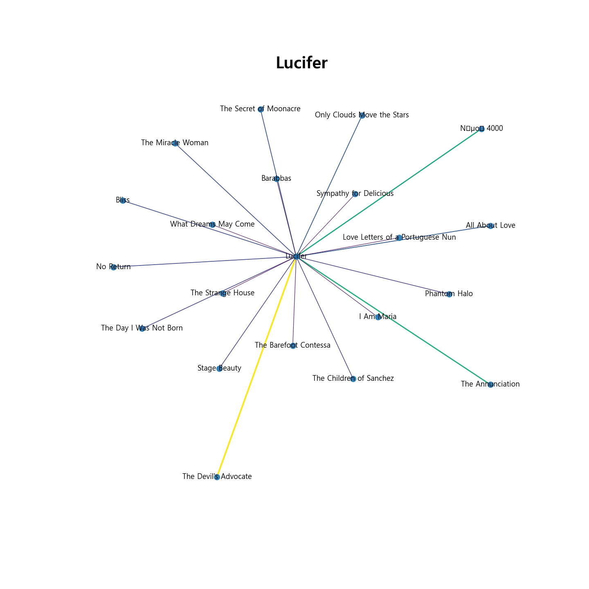

# 넷플릭스 추천 시스템

## 프로젝트 선정

- 기존 프로젝트는 IITP 산학프로젝트에 연관된 병원 데이터를 가지고 진행하려고 했지만, 교육 사정으로 인하여 팀 병합이 진행되어 병원데이터가 아닌 기존에 관심있는 `NLP` 관련 프로젝트를 진행
- `NLP`중 연관성 분석을 해보고자 상대적으로 쉽게 구할 수 있는 Netflex데이터를 이용하여 프로젝트 진행

## 프로젝트 내용

1. 분석

   1. Kaggle 에있는 Netflex데이터를 이용하여 연관성 분석
   1. 분석 프로세스

      1. 같은 장르의 데이터를 분류하여 추출
      1. na값 제거 등 불용어 처리진행
      1. `TF-IDF`를 사용하여 유사단어 추출
      1. TF-IDF를 사용하여 추출한 단어를 기반으로 COS 유사도 측정
      1. 측정된 유사도를 기반으로 `Network Plot` 생성

   1. 분석시 줄거리를 데이터로 이용하여 분석함

   1. 시각화
      1. 분석하여 나온 결과를 `Network Plot`을 이용하여 시각화 해줌
         - Network Plot은 `NetworkX` 라이브러리를 사용함

1. 사용 라이브러리
   1. 분석
      1. pandas
      1. numpy
      1. sklearn
   1. 시각화
      1. networkx
      1. matplotlib

## 결과

1. 
1. 

   - 선이 굵을수록 유사한 내용을 가진 영화다.
