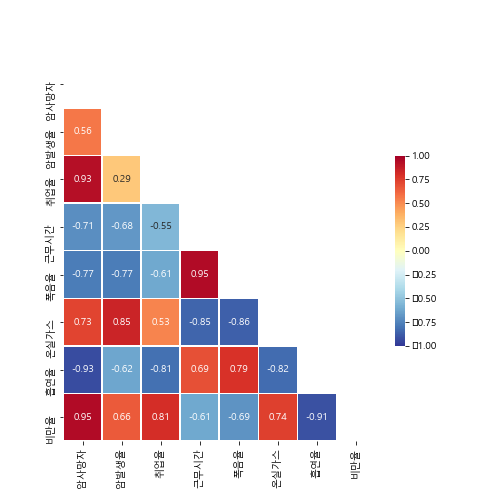
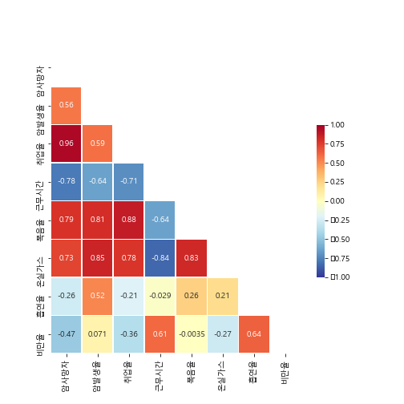
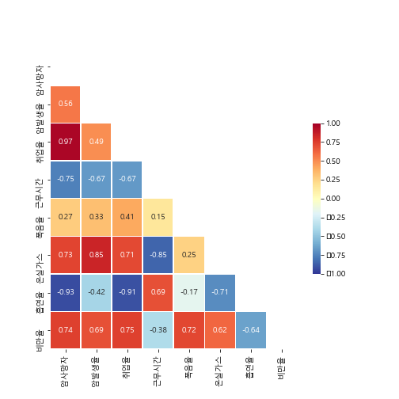
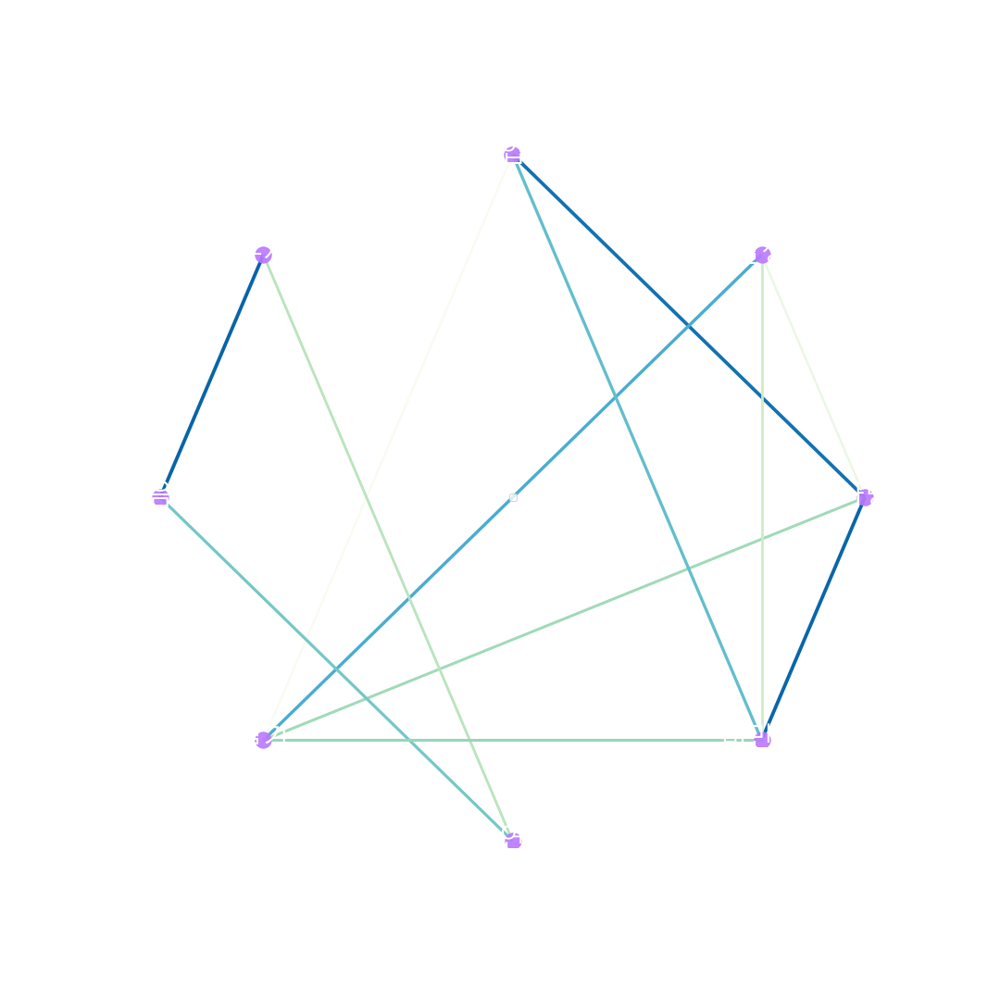
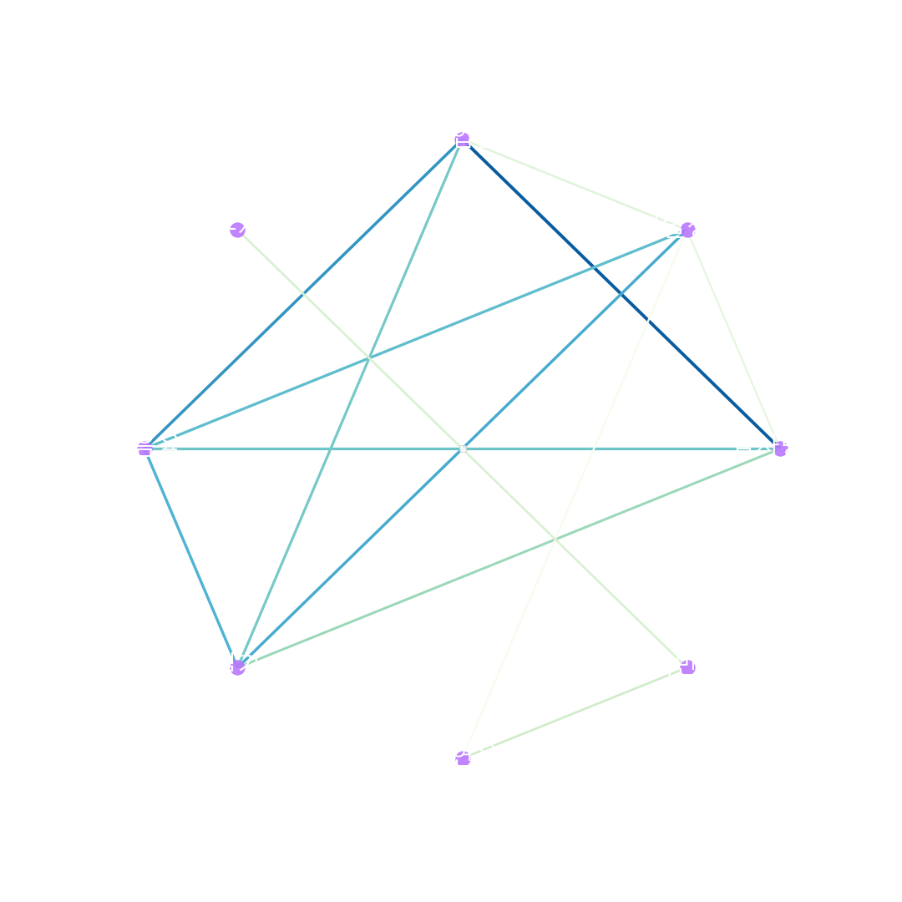
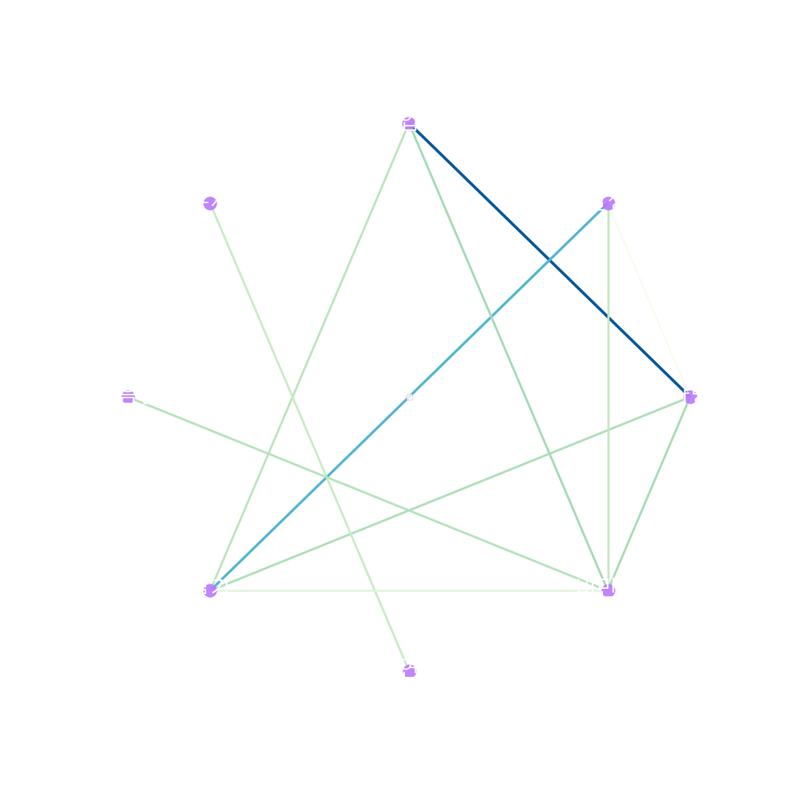
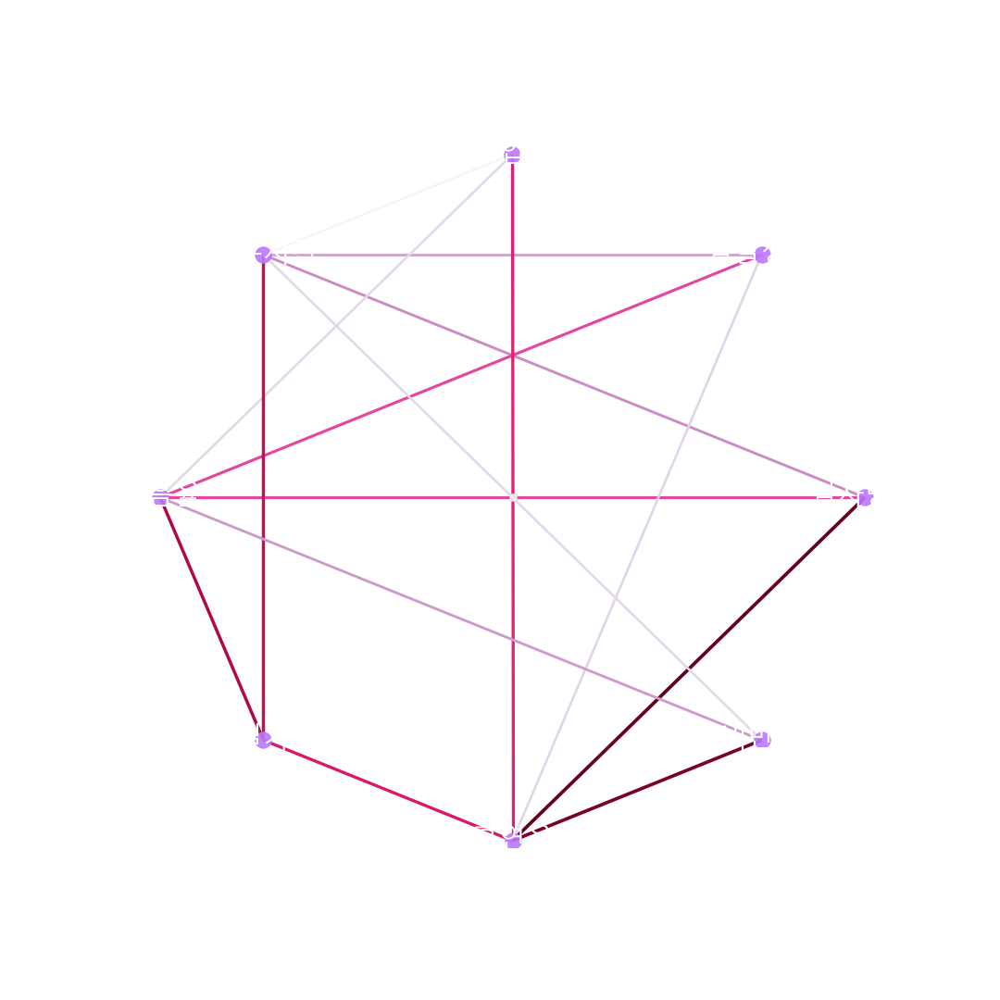
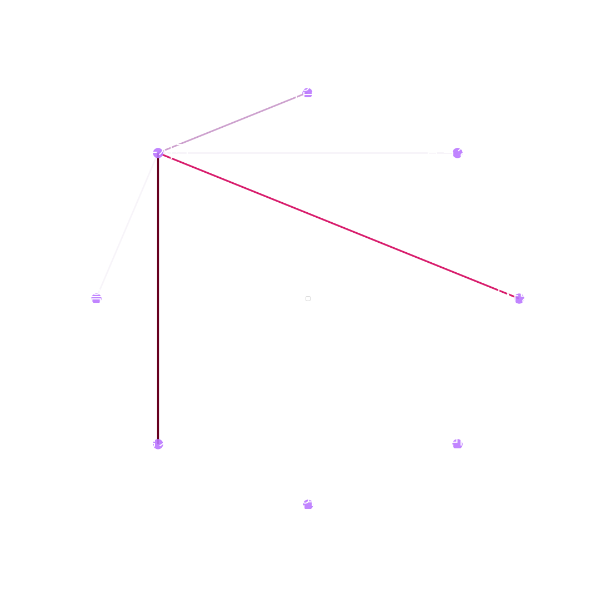
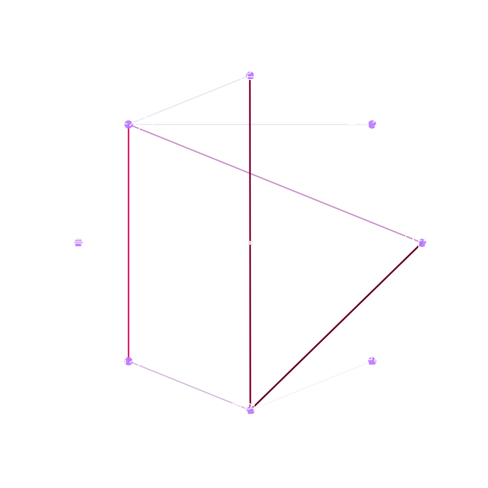

# 암과 여러 요인간의 상관관계분석

## 구현한것들

- 상관성분석
- heatmap을 이용한 상관분석 시각화
- Networkx를 이용한 correlation Ploting

## 결과

### HeatMap

|                      | 남성                                                                       | 여성                                                                       | 전체                                                                       |
| -------------------- | -------------------------------------------------------------------------- | -------------------------------------------------------------------------- | -------------------------------------------------------------------------- |
| HeatMap              |                           |                           |                       |
| NetworPlot Posivtive |  |  |  |
| NetworPlot negative  |  |  |  |

## 코드

[Cancer Corr](./code/main.py)

## 개성사항

- 시간이 부족해서 (정보처리 기사 시험과 겹쳤다) 시간을 매우 조금 들였기 떄문에 이렇다할 결과를 얻지 못 했다.
  - 자료 수집 부족, 분석 내용 부족
  - 단순 상관계수 분석만하고, ML등을 수행하지 않았다.
- 추후 개선한다면, 자료수집을 더 하고, 제대로된 분석까지 진행해야겠다.
