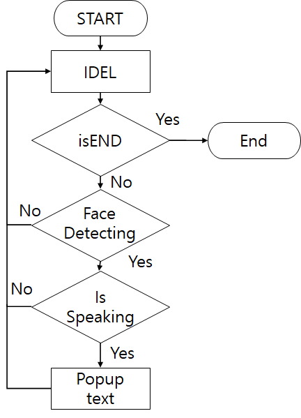
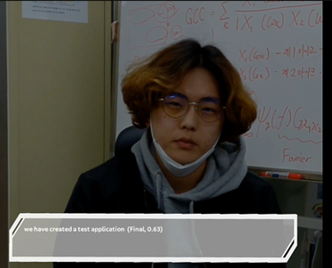

# 청각장애인을 위한 스마트글래스(팀프로젝트 2인)

## 수행기간

- 2019년 12월 ~ 2020년 05월

## 개발 목표

- Magic_Leap의 카메라 및 마이크를 이용하여 정보수집
- OpenCV를 인식을 하여 사람이 인식되면 TTS시작
- STT를 이용하여 상대방이 말하는 것을 텍스트로 시각화

## 개발 환경

1. OS

   - 개발환경 : Window10

   - 플랫폼 : lumin OS

1. 사용장비
   - Magic Leap
1. 사용기술 및 환경 :
   - OPENCV 3.4.9
   - IBM WATSON TTS
   - Unity 2019.2.0f1
   - Visual Studio 2019

## 구현 기능

-Face Detection
-Speech to Text

## 프로젝트 흐름도

## 프로젝트설명

프로그램을 시작하면, Magic Leap의 카메라와 마이크를 불러옵니다.
불러온 카메라를 이용하여 카메라상에 사람 얼굴을 인식하면 STT 단계를 시작합니다.
만약 상대방이 말을 한다면 STT를 이용하여 텍스트를 불러옵니다.
불러온 텍스트를 화면 UI 하단에 출력합니다.

## 프로젝트 결과화면

## 담당 역할

1. IBM Watson을 이용하여 STT를 적용시키고, 화면에 출력
1. OpenCV의 “haar Classifier Cascade”를 이용하여 얼굴인식 구현
1. 구현된 코드를 Magic_Leap와 동기화
