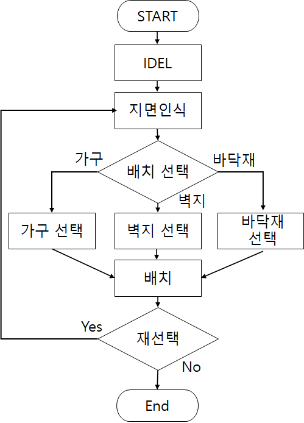
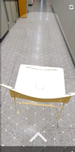

# AR을 이용한 증강현실 인테리어 (3인)

## 수행기간

- 2019년 5월 ~ 2019년 10월

## 개발 목표

- 안드로이드를 이용하여 보유한 3D 오브젝트를 AR로 시각화 시키는 것
- 인식된 부분을 벽지 및 바닥재로 시각화 시키는 것

## 개발 환경

1. OS

   - 개발환경 : Window10 Pro
   - 플랫폼 : Android 8.0 ‘Oreo’

1. 사용장비
   - Android ( LG-V50 )
1. 사용기술 및 환경 :

   - IDE : Visual Studio 2019
   - Engine : Unity 2019.2.0f1
   - SDK : arcore-unity-sdk-1.20.0

## 구현 기능

- Object interaction
- AR visualization

## 프로젝트 흐름도

## 프로젝트설명

프로그램을 시작하면 지면인식을 시작합니다.
지면인식이 되면 아래 화살표를 눌러 자재 및 가구를 선택합니다.
만약 가구를 선택하였다면 인식된 지면에 클릭하여 생성하고, 원하는 위치로 드래그 및 회전시켜 배치시킵니다.
바닥재를 선택했다면, 클릭한 지면을 선택한 바닥재 패턴으로 변경시킵니다.
종료버튼을 누르면 프로그램을 종료합니다.

## 프로젝트 결과화면

## 담당 역할

1. 사용할 3d 모델 수집
1. 가구 선택창에서 가구를 선택하면 그에 맞는 Resource 디렉토리에 있는 3D오브젝트를 가져와 인식된 지면에 생성
1. UI 구현
